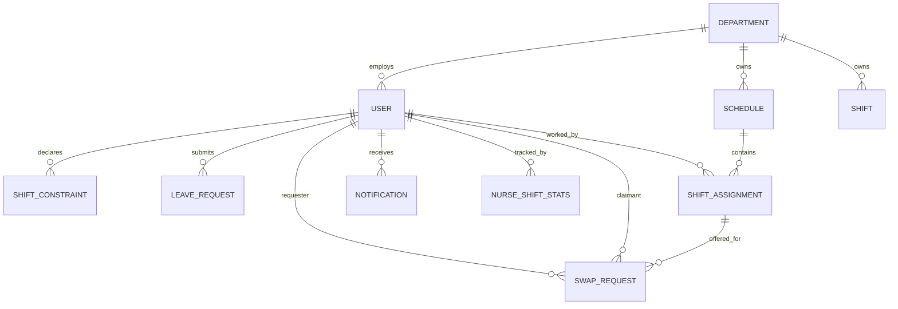

# System Architecture Document — Smart Nurse Scheduling System

> **Version:** 1.0
> **Stack:** React 18 · FastAPI · PostgreSQL · Docker · Min-Cost Max-Flow
> **Team:** Ido Levy, Nereya Mantzur

---

## 1. System Overview

### 1.1 Goals
The **Smart Nurse Scheduling System (SNSS)** is an end-to-end web platform that automates the generation, publication, and post-publication maintenance of weekly nurse rosters in hospital departments. Its primary goals are:

- **Automate** what is today an hours-long manual process performed weekly by head nurses.
- **Guarantee compliance** with mandatory labor and rest rules (24-hour rest after night, max 6 consecutive workdays, max 2 night shifts per week, etc.).
- **Maximize staff satisfaction** by honoring personal preferences (`PREFER` / `PREFER_NOT`) and approved leave requests.
- **Ensure fairness** in the distribution of difficult shifts (nights, weekends) using a per-nurse fatigue index.
- **Decentralize** post-publish modifications via a peer-to-peer **Swap Marketplace**, removing the manager from routine swap mediation.

### 1.2 Target Audience
| Persona | Needs |
|---------|-------|
| **Nurse** | View personal schedule, submit constraints/leave, claim/offer swaps, track monthly hours. |
| **Head Nurse** | Generate, review, and publish weekly schedules; approve leaves; manage department staff. |
| **Admin** | Full administrative access including department configuration and user lifecycle. |

### 1.3 Problem Statement
Building a weekly shift schedule is an **NP-hard combinatorial assignment problem** complicated by labor-law hard constraints, employment-percentage quotas, personal preferences, and approved leave. Manual construction is slow, error-prone, and often non-compliant with rest rules. Post-publication changes (last-minute leaves, swaps) further compound the load on the head nurse. SNSS replaces this workflow with a deterministic, auditable, and constraint-aware pipeline.

---

## 2. Architectural Pattern

### 2.1 Selected Patterns
| Pattern | Where Applied | Reason |
|---------|--------------|--------|
| **Client–Server** (3-tier) | Browser SPA → API → DB | Clear separation of presentation, business logic, and persistence. |
| **REST over HTTP/JSON** | All backend endpoints | Standard, cacheable, framework-agnostic; first-class FastAPI support. |
| **Stateless JWT Authentication** | Backend auth layer | No server-side sessions → horizontal scaling without sticky sessions. |
| **Layered Backend** (Routers → Services → ORM) | FastAPI app | Single-responsibility per file; routers stay thin, business logic isolated. |
| **Repository-style ORM access** | SQLAlchemy 2 + dependency injection (`get_db`) | Per-request session lifecycle, testable units. |
| **Component-based SPA** with Context API | React 18 frontend | Avoids Redux overhead; auth state shared via `AuthContext`, page-local state otherwise. |
| **Strategy + Repair Loop** | `scheduler.py` | Wraps Min-Cost Max-Flow with iterative repair to enforce non-encodable hard constraints. |
| **Monte Carlo Search** | Scheduler optimization | 50 randomized iterations to escape local optima of the MCMF cost function. |
| **Reverse Proxy** (Nginx) | Production edge | Serves SPA, proxies `/api/*` to backend, resolves CORS, caches static assets. |
| **Containerization** (Docker Compose) | Deployment | Reproducible, single-command bring-up. |

### 2.2 Pattern Rejections (Explicit Trade-offs)
| Rejected | Replaced With | Reason |
|----------|---------------|--------|
| Pure ILP (Integer Linear Programming) | MCMF + Repair Loop | ILP is computationally expensive at department scale; MCMF runs in milliseconds. |
| WebSockets / Server-Sent Events | 30-second client polling | Domain tolerates 30-second latency; eliminates connection-management complexity. |
| Redux / Zustand | React Context + local `useState` | Application state is mostly per-page; global state is limited to auth. |
| Microservices | Modular monolith (one FastAPI app, 11 routers) | Project scale does not justify network-boundary overhead. |
| Session cookies | JWT Bearer tokens | Stateless backend; same scheme works for future mobile clients. |

---

## 3. High-Level Architecture

### 3.1 Conceptual Diagram

```mermaid
graph LR
    subgraph "Client Tier"
        UI[React 18 SPA<br/>Vite · Tailwind · Recharts<br/>React Router 6]
    end

    subgraph "Edge Tier"
        NX[Nginx<br/>SPA host + Reverse Proxy<br/>:80 / :3000]
    end

    subgraph "Application Tier"
        API[FastAPI App<br/>Pydantic · JWT · SQLAlchemy<br/>:8000]
        SCH[Scheduling Engine<br/>MCMF + Repair + Fairness]
    end

    subgraph "Data Tier"
        DB[(PostgreSQL<br/>Neon Cloud)]
    end

    UI -->|HTTPS / JWT Bearer| NX
    NX -->|/api/*| API
    NX -->|/ (static)| UI
    API -->|ORM Session| DB
    API -->|invoke| SCH
    SCH -->|read constraints,<br/>write assignments| DB
```

### 3.2 Component Interaction Summary
1. **Browser** loads the React SPA from Nginx, then issues authenticated XHR calls to `/api/*`.
2. **Nginx** serves the static SPA and reverse-proxies API traffic to the FastAPI container over Docker's internal DNS (service `backend`).
3. **FastAPI** validates JWT, dispatches to the appropriate router, enforces RBAC via `require_role` dependencies, and performs ORM operations.
4. **Scheduler Engine** is invoked synchronously by the `/api/schedules/generate` endpoint, reads constraints/leaves from the DB, runs the MCMF + repair + force-fill pipeline, and persists assignments.
5. **PostgreSQL** stores all relational state. Cloud-hosted on Neon; development falls back to SQLite when `DATABASE_URL` is unset.

### 3.3 Deployment Topology
```
host:3000  → frontend container (Nginx)
                ├── serves /        (static SPA bundle)
                └── proxies /api/*  → backend:8000
host:8000  → backend container  (uvicorn + FastAPI)
                └── outbound TLS  → Neon PostgreSQL
```
Containers are orchestrated via `docker-compose.yml`. The frontend declares `depends_on: backend (service_healthy)`, ensuring the API is reachable before the SPA is served.

---

## 4. Component Breakdown

### 4.1 Client / Frontend

#### Folder layout
```
frontend/src/
├── api.js              # Axios instance + 401 interceptor
├── App.jsx             # Router + PrivateRoute / ManagerRoute guards
├── main.jsx            # Entry, mounts <AuthProvider>
├── components/
│   ├── Navbar.jsx
│   └── ShiftHoursSummary.jsx
├── context/
│   └── AuthContext.jsx # Global auth state (user, login, logout)
└── pages/              # 12 route-level components
```

#### Layers
| Layer | Responsibility | Representative Files |
|-------|---------------|----------------------|
| **Views (Pages)** | Render UI, handle user interaction, own page-local state via `useState`/`useEffect`. | [Dashboard.jsx](frontend/src/pages/Dashboard.jsx), [ScheduleView.jsx](frontend/src/pages/ScheduleView.jsx), [ManageSchedule.jsx](frontend/src/pages/ManageSchedule.jsx) |
| **Components** | Reusable UI fragments: top nav, charts, summary widget. | [Navbar.jsx](frontend/src/components/Navbar.jsx), [ShiftHoursSummary.jsx](frontend/src/components/ShiftHoursSummary.jsx) |
| **Context (Global State)** | Cross-cutting auth state and login/logout actions. | [AuthContext.jsx](frontend/src/context/AuthContext.jsx) |
| **API Client (Repository)** | Single Axios instance; injects JWT; centralized 401 handling. | [api.js](frontend/src/api.js) |
| **Routing & Guards** | Declarative routes; `PrivateRoute` and `ManagerRoute` enforce auth and role-based access. | [App.jsx](frontend/src/App.jsx) |

#### State management strategy
- **Global state** — Only authentication (`user`, `loading`, `login`, `logout`) lives in `AuthContext`. Backed by `sessionStorage` so reloads do not lose the session.
- **Page-local state** — `useState`/`useReducer` per page; data is re-fetched on mount via `useEffect`.
- **Server state caching** — Intentionally minimal; freshness is preferred over caching for scheduling data.
- **Notifications** — Polled every **30 seconds** in `Navbar.jsx` against `GET /api/notifications/unread-count`.

#### UI / build tooling
- **Vite** for dev server + production bundling (esbuild + Rollup).
- **Tailwind CSS** for utility-first styling.
- **Recharts** for the monthly hours summary (donut + bar charts).
- **React Router 6** declarative routing.

---

### 4.2 Backend / API

#### Folder layout
```
backend/app/
├── main.py             # App factory, CORS, router registration
├── config.py           # Env loading (DATABASE_URL, SECRET_KEY, …)
├── database.py         # Engine, SessionLocal, Base, get_db dependency
├── models.py           # 10 SQLAlchemy ORM models + 5 enums
├── schemas.py          # Pydantic DTOs (request + response)
├── auth.py             # JWT, bcrypt, get_current_user, require_role
├── scheduler.py        # Min-Cost Max-Flow + repair + force-fill + fairness
└── routers/            # 11 thin HTTP layers
    ├── auth.py
    ├── users.py
    ├── departments.py
    ├── constraints.py
    ├── leave_requests.py
    ├── schedules.py
    ├── shifts.py
    ├── swap_requests.py
    ├── notifications.py
    ├── shift_summary.py
    └── fairness.py
```

#### Layer responsibilities
| Layer | File(s) | Responsibility |
|-------|---------|---------------|
| **App composition** | [main.py](backend/app/main.py) | Instantiates `FastAPI`, configures CORS, registers all routers, runs idempotent DDL cleanup at startup. |
| **Configuration** | [config.py](backend/app/config.py) | Loads env vars (`DATABASE_URL`, `SECRET_KEY`, `ALGORITHM`, `ACCESS_TOKEN_EXPIRE_MINUTES`). |
| **Persistence engine** | [database.py](backend/app/database.py) | SQLAlchemy 2 engine, `SessionLocal`, declarative `Base`, `get_db()` dependency yielding a per-request session. |
| **Domain model** | [models.py](backend/app/models.py) | ORM entities + enums (`RoleEnum`, `ShiftType`, `RequestStatus`, `ConstraintType`, `SwapRequestStatus`). |
| **DTOs / Validation** | [schemas.py](backend/app/schemas.py) | Pydantic models for inbound payloads and outbound responses. |
| **Security** | [auth.py](backend/app/auth.py) | `hash_password`, `verify_password`, `create_access_token`, `get_current_user`, `require_role(*roles)`. |
| **Routers (Controllers)** | `routers/*.py` | Map HTTP verbs to handlers; validate inputs via Pydantic; inject `db` + `current_user` via `Depends`; delegate to ORM/services. |
| **Service / Algorithm** | [scheduler.py](backend/app/scheduler.py) | Pure-Python core: data extraction → MCMF → repair loop → Monte Carlo scoring → force-fill → DB persistence + fairness update. |

#### Core algorithmic logic (`scheduler.py`)

**Phase 1 — Min-Cost Max-Flow** (NetworkX)
- Build a directed flow network:
  - `source → nurse_i` with capacity = weekly cap (derived from `employment_percentage`).
  - `nurse_i → shift_j` with capacity 1 and cost ∈ {0, 1, 2} from `ConstraintType` (`PREFER`=0, default=1, `PREFER_NOT`=2).
  - `shift_j → sink` with capacity = `required_staff`.
- Edges blocked by static hard rules (`CANNOT_WORK` constraint or approved leave) are **omitted entirely**.

**Phase 2 — Hard-Constraint Repair Loop** (`_solve_with_constraints`)
- Solve flow → inspect resulting assignments → detect violations of inter-shift rules → add violators to `hard_blocks` → re-solve. Up to **10 repair rounds** per Monte Carlo iteration.
- Detected rules (`_detect_constraint_violations`):
  1. Night → block Morning & Afternoon next day (24 h rest).
  2. Afternoon → block Morning next day (8 h rest).
  3. Max 6 consecutive workdays.
  4. Max 2 night shifts per 7-day window.
  5. Max 2 consecutive nights.

**Phase 3 — Monte Carlo wrapper**
- **50 iterations** with shuffled edge order and stochastic dropping of some `PREFER_NOT` edges to explore alternatives.
- Each candidate scored by `evaluate_schedule`:

| Component | Weight |
|-----------|--------|
| Filled-slot bonus | +100 |
| Unfilled-slot penalty | −200 |
| `PREFER` match bonus | +10 |
| Utilization variance penalty | −50 × var |
| Hard-constraint violation | −10,000 |

**Phase 4 — Fairness-Aware Force-Fill** (`_force_fill_shifts`)
- Any slot still under-staffed after MCMF triggers a deterministic force-assignment.
- The eligible nurse with the **lowest `fatigue_index`** in `NurseShiftStats` is selected (random tiebreak).
- Three eligibility tiers (ideal → relax weekly cap → override `CANNOT_WORK` as last resort). Approved leaves are **never** overridden.

**Phase 5 — Stats Update** (`update_nurse_stats`)
- Every persisted assignment increments per-nurse counters and recomputes:
  ```
  fatigue_index = 2.0·nights + 1.5·weekends + 3.0·forced
  ```

---

### 4.3 Database / Storage

#### Engine
- **Production:** PostgreSQL (Neon Cloud, serverless, TLS-only).
- **Development:** SQLite file (`./nurse_scheduling.db`) when `DATABASE_URL` is not set.
- **ORM:** SQLAlchemy 2.x declarative; schema bootstrapped via `Base.metadata.create_all()` on startup. Lightweight idempotent DDL cleanup runs at boot to drop deprecated columns.

#### Entity-Relationship Diagram


#### Table Catalog
| Table | Key Columns | Purpose |
|-------|------------|---------|
| `users` | `id`, `email` (UQ), `hashed_password`, `role`, `department_id`, `employment_percentage`, `is_active` | Identity + employment profile. |
| `departments` | `id`, `name` (UQ), `min_nurses_morning/afternoon/night` | Tenant scope + minimum staffing defaults. |
| `schedules` | `id`, `department_id`, `week_start_date`, `is_published` | Weekly roster; draft/published lifecycle. |
| `shift_assignments` | `id`, `schedule_id`, `nurse_id`, `date`, `shift_type` | The actual roster entries. |
| `shifts` | `id`, `department_id`, `date`, `shift_type`, `required_staff` (UQ on `dept+date+type`) | Pre-week slot definitions. |
| `shift_constraints` | `id`, `nurse_id`, `date`, `shift_type`, `constraint_type` | Nurse preference declarations. |
| `leave_requests` | `id`, `nurse_id`, `start_date`, `end_date`, `reason`, `status` | Leave workflow with approval state. |
| `swap_requests` | `id`, `shift_assignment_id`, `requester_id`, `claimant_id`, `status`, `note`, `created_at` | Peer-to-peer swap marketplace state. |
| `notifications` | `id`, `user_id`, `message`, `is_read`, `created_at` | In-app messaging. |
| `nurse_shift_stats` | `id`, `nurse_id`, `period_year`, `period_month`, `night_shifts_count`, `weekend_shifts_count`, `total_shifts_count`, `forced_assignments_count`, `fatigue_index` (UQ on `nurse+year+month`) | Per-month fairness state used by the force-fill phase. |

#### Schema design notes
- **Enums** are PostgreSQL native ENUMs (`role`, `shift_type`, `request_status`, `constraint_type`, `swap_request_status`).
- **Cascade delete** on `ShiftAssignment → SwapRequest` (cancelling an assignment cleans up its swap offers).
- **Unique constraints** prevent duplicate per-period stats rows and duplicate shift slots.
- **No soft deletes** — entities are either active flags (`users.is_active`) or hard-deleted (constraints).
- **Denormalized `fatigue_index`** on `nurse_shift_stats` enables fast `ORDER BY` for fairness selection without computing on each scheduling call.

---

## 5. Data Flow — Critical Use Case: *Generate Weekly Schedule*

```mermaid
sequenceDiagram
    autonumber
    participant U as Head Nurse (Browser)
    participant N as Nginx
    participant F as FastAPI Router
    participant A as Auth Dependency
    participant S as Scheduler Engine
    participant D as PostgreSQL

    U->>N: POST /api/schedules/generate {department_id, week_start}
    N->>F: proxy → backend:8000
    F->>A: Depends(require_role(HEAD_NURSE, ADMIN))
    A->>D: SELECT user WHERE id = jwt.sub
    A-->>F: User (role validated)
    F->>D: SELECT shifts WHERE dept=? AND week=?
    F->>D: SELECT users WHERE role=NURSE AND dept=?
    F->>D: SELECT shift_constraints WHERE date IN week
    F->>D: SELECT leave_requests WHERE status=APPROVED
    F->>S: generate_schedule(nurses, shifts, constraints, leaves)
    loop 50 Monte Carlo iterations
        S->>S: build flow graph (random tiebreak)
        loop up to 10 repair rounds
            S->>S: MCMF solve → detect violations
            alt violations found
                S->>S: add to hard_blocks, re-solve
            else feasible
                S->>S: evaluate_schedule → score
            end
        end
    end
    S->>S: pick highest-scoring candidate
    S->>S: force-fill undermanned slots (fairness)
    S->>D: BEGIN; INSERT schedule + assignments
    S->>D: UPDATE nurse_shift_stats (fatigue)
    S->>D: COMMIT
    S-->>F: ScheduleResponse {id, assignments[], warnings[]}
    F-->>N: 201 Created (JSON)
    N-->>U: render draft schedule + warnings
    U->>F: PUT /api/schedules/{id}/publish
    F->>D: UPDATE schedules SET is_published=true
    F-->>U: 200 OK → nurses can now see it
```

### Step-by-step narrative
1. Head Nurse clicks **Generate Schedule** — React submits `POST /api/schedules/generate`.
2. Nginx routes the request to the backend; FastAPI validates the JWT and enforces `head_nurse` or `admin` role.
3. The router loads inputs: shift slots, active nurses, constraints, and approved leave for the target week.
4. **Static hard blocks** are computed: `CANNOT_WORK` constraints + every (date × shift) covered by an approved leave.
5. The scheduler runs **50 Monte Carlo iterations**, each performing MCMF + a repair loop (up to 10 rounds) to enforce inter-shift labor rules.
6. The highest-scoring feasible candidate is selected.
7. **Force-fill** ensures 100 % coverage by selecting the lowest-fatigue nurse for any remaining gap.
8. All assignments are persisted in a **single transaction**; `nurse_shift_stats` is updated atomically.
9. The draft schedule is returned with warnings (e.g., forced assignments) for human review.
10. A subsequent **publish** call flips `is_published=true`, making the roster visible to nurses.

---

## 6. API Contracts & Interfaces

All endpoints are mounted under `/api`. Authentication is `Authorization: Bearer <JWT>` unless noted. Full OpenAPI docs are live at `/docs` (Swagger UI).

### 6.1 Authentication

**POST `/api/auth/login`** — OAuth2 password flow.
```http
POST /api/auth/login
Content-Type: application/x-www-form-urlencoded

username=alice@hospital.org&password=secret
```
```json
{
  "access_token": "eyJhbGciOiJIUzI1NiIsInR5cCI6IkpXVCJ9...",
  "token_type": "bearer"
}
```

**GET `/api/auth/me`** — current user.
```json
{
  "id": 17,
  "email": "alice@hospital.org",
  "first_name": "Alice",
  "last_name": "Cohen",
  "role": "head_nurse",
  "department_id": 2,
  "employment_percentage": 100,
  "is_active": true
}
```

### 6.2 Schedule Generation

**POST `/api/schedules/generate`** — head_nurse / admin.
```json
{
  "department_id": 2,
  "week_start_date": "2026-06-01"
}
```
**201 Created**
```json
{
  "id": 42,
  "department_id": 2,
  "week_start_date": "2026-06-01",
  "is_published": false,
  "assignments": [
    { "id": 901, "nurse_id": 17, "date": "2026-06-01", "shift_type": "morning" },
    { "id": 902, "nurse_id": 23, "date": "2026-06-01", "shift_type": "afternoon" }
  ],
  "warnings": [
    "Force-assigned nurse 23 to 2026-06-04 NIGHT (lowest fatigue tier 1)"
  ],
  "total_required": 42,
  "total_assigned": 42
}
```

**PUT `/api/schedules/{id}/publish`** — head_nurse / admin → `200 OK`.

### 6.3 Constraints

**POST `/api/constraints/`**
```json
{
  "date": "2026-06-03",
  "shift_type": "night",
  "constraint_type": "cannot_work"
}
```

### 6.4 Leave Requests

**POST `/api/leave-requests/`**
```json
{ "start_date": "2026-06-10", "end_date": "2026-06-12", "reason": "Family event" }
```
**PUT `/api/leave-requests/{id}/review`** — head_nurse / admin.
```json
{ "status": "approved" }
```

### 6.5 Shift Swap Marketplace

**POST `/api/swap-requests`**
```json
{ "shift_assignment_id": 901, "note": "Will trade morning for afternoon" }
```
**POST `/api/swap-requests/{id}/claim`** — atomic transfer.
```json
{ "id": 7, "status": "claimed", "claimant_id": 23, "shift_assignment_id": 901 }
```

### 6.6 Monthly Hours Summary

**GET `/api/shift-summary/me?year=2026&month=6`**
```json
{
  "year": 2026,
  "month": 6,
  "monthly_quota": 160,
  "effective_quota": 136,
  "leave_days": 3,
  "leave_hours": 24,
  "total_hours": 80,
  "hours_remaining": 56,
  "completion_pct": 58.8,
  "shifts_count": 10,
  "avg_hours_per_shift": 8.0,
  "most_frequent_shift": "morning",
  "shift_breakdown": {
    "morning":   { "count": 6, "hours": 48 },
    "afternoon": { "count": 3, "hours": 24 },
    "night":     { "count": 1, "hours":  8 }
  }
}
```

### 6.7 Error envelope
FastAPI returns RFC-style JSON errors:
```json
{ "detail": "Insufficient permissions" }
```
With validation errors (Pydantic):
```json
{
  "detail": [
    { "loc": ["body", "date"], "msg": "field required", "type": "value_error.missing" }
  ]
}
```

---

## 7. Security & Authentication

### 7.1 Authentication
- **Scheme:** OAuth2 Password Flow → stateless **JWT (HS256)** signed with `SECRET_KEY` from `.env`.
- **Library:** `python-jose` for sign/verify; `passlib[bcrypt]` for password hashing.
- **Token lifetime:** `ACCESS_TOKEN_EXPIRE_MINUTES` (default 480 min / 8 hours).
- **Payload:** `{ "sub": "<user_id>", "exp": <unix_ts> }` — no PII in the token.
- **Client storage:** Browser `sessionStorage` — cleared on tab close, mitigates persistent XSS-style token exfiltration.
- **Transport:** Designed for HTTPS deployment; Nginx terminates TLS in production.

### 7.2 Authorization (RBAC)
Three roles via the `RoleEnum`:
| Role | Granted Operations |
|------|-------------------|
| `nurse` | Self-service: own schedule, own constraints, own leave requests, swap marketplace, own hours summary. |
| `head_nurse` | All nurse operations + schedule generation/publication + leave approval + user management. |
| `admin` | All head_nurse operations + department CRUD. |

Enforcement is centralized in [auth.py](backend/app/auth.py):
```python
def require_role(*roles: RoleEnum):
    def role_checker(current_user: User = Depends(get_current_user)):
        if current_user.role not in roles:
            raise HTTPException(status.HTTP_403_FORBIDDEN, "Insufficient permissions")
        return current_user
    return role_checker
```
Every protected route declares `Depends(require_role(...))`, guaranteeing **a uniform check at every entry point** (no router-internal role logic).

### 7.3 Data Privacy & Access Control
- **Row-level scoping:** Read endpoints filter by `current_user.id` for nurses and by `department_id` for managers, preventing cross-tenant data exposure.
- **Self-only mutation:** Nurses can only `DELETE` their **own** constraints / swap offers; the server checks `requester_id == current_user.id` before any modification.
- **Cross-department blocking:** Swap claims validate the claimant's department matches the offered shift's department.
- **Approved leave is immutable** by the force-fill phase — even override tiers in the scheduler never violate an approved leave.

### 7.4 Other Security Practices
- **Password hashing:** bcrypt with library-default cost; only `hashed_password` is persisted.
- **CORS:** Whitelist limited to known origins (`http://localhost:3000`, `http://localhost:5173`) in [main.py](backend/app/main.py).
- **Input validation:** All request bodies validated by Pydantic; SQL is parameterized via SQLAlchemy ORM (no string concatenation).
- **Secrets hygiene:** `.env` is git-ignored and mounted via `env_file:` in Docker Compose — never baked into images.
- **Client 401 handling:** Centralized Axios interceptor in [api.js](frontend/src/api.js) clears stale tokens and redirects to `/login` on 401, except for the login endpoint itself.

### 7.5 Known Hardening Items (Recommended Next Steps)
- Add per-IP rate limiting on `/api/auth/login`.
- Move tokens to `HttpOnly` cookies with `SameSite=Strict` to eliminate XSS token theft.
- Enforce password complexity at registration.
- Add audit log table for sensitive actions (publish, role change, leave approval).

---

## 8. Error Handling & Logging

### 8.1 Backend Strategy
- **Exception model:** FastAPI's `HTTPException` is the canonical raising mechanism. Codes used:
  - `400 Bad Request` — semantic validation failures (e.g., end_date before start_date).
  - `401 Unauthorized` — missing/invalid/expired JWT.
  - `403 Forbidden` — authenticated but role insufficient.
  - `404 Not Found` — entity does not exist or is not visible to the caller.
  - `409 Conflict` — business-rule violation (e.g., publishing twice, duplicate swap offer).
  - `422 Unprocessable Entity` — Pydantic field-level validation errors.
  - `500 Internal Server Error` — unhandled exceptions (logged with stack trace).
- **DB transactions:** Multi-step writes (schedule generation, swap claim, leave review) are wrapped in `db.begin()` so partial failures roll back atomically. `try/except SQLAlchemyError` blocks log and re-raise as `500`.
- **Scheduler resilience:** Each Monte Carlo iteration is isolated in `try/except`; a failed iteration is logged at `WARNING` and excluded from candidate selection — generation never aborts because of a single solver failure.

### 8.2 Logging
- **Library:** Python stdlib `logging` (`logger = logging.getLogger(__name__)`).
- **Levels used:**
  - `DEBUG` — graph build details, candidate scores, force-fill tier transitions.
  - `INFO` — schedule generation start/finish, publish events, user login.
  - `WARNING` — repair loop hitting its 10-round cap, force-fill invoked, deprecated DDL cleanup actions.
  - `ERROR` — DB errors, JWT decode failures, unhandled exceptions.
- **Output:** stdout/stderr → captured by Docker's logging driver (`docker compose logs -f backend`).
- **Health check:** Docker `healthcheck` hits `GET /` every 30 s; the frontend container waits for `service_healthy` before starting.

### 8.3 Frontend Strategy
- **API errors:** Axios `response` interceptor handles 401 globally; page-level `.catch` blocks surface user-friendly messages via inline error banners.
- **Loading state:** Every async page tracks `loading` to prevent UI race conditions.
- **Defensive rendering:** Optional chaining and default values throughout to avoid crashes on partial data.
- **Console logging:** Reserved for unexpected client errors; server validation messages are shown in the UI verbatim.

### 8.4 Monitoring & Observability (Current vs. Future)
| Concern | Current | Future |
|---------|---------|--------|
| Liveness | Docker healthcheck on `/` | Add `/healthz` (DB ping) and `/readyz`. |
| Metrics | None | Prometheus exporter + Grafana dashboards (latency, error rate, scheduler runtime). |
| Tracing | None | OpenTelemetry instrumentation across FastAPI + SQLAlchemy. |
| Centralized logs | Docker stdout | Ship to Loki / ELK / CloudWatch. |
| Alerts | None | PagerDuty/Slack on 5xx spikes or scheduler failures. |

---

*Smart Nurse Scheduling System — System Architecture Document, 2026.*
