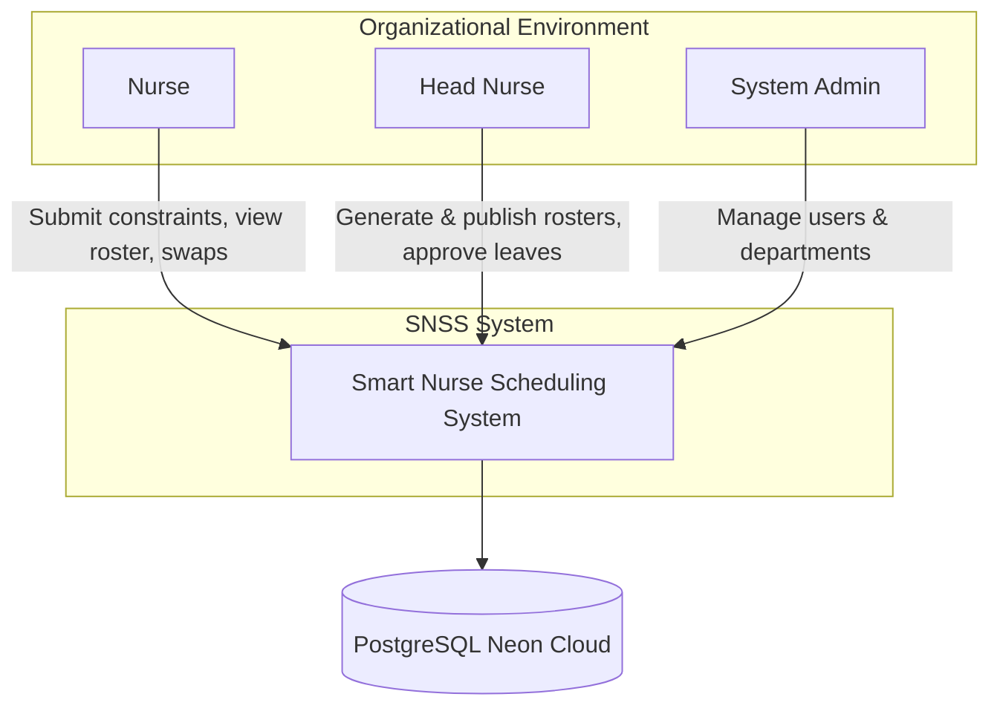
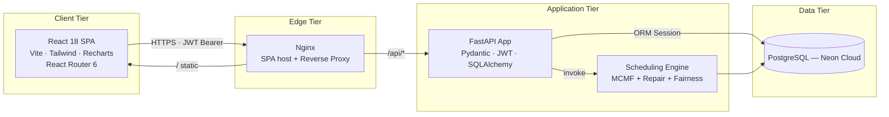
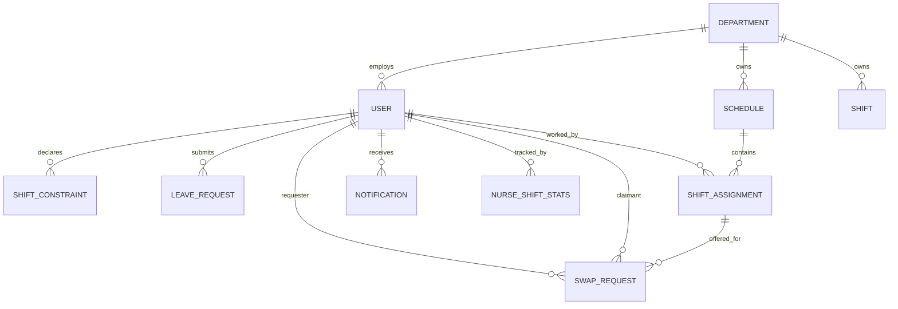
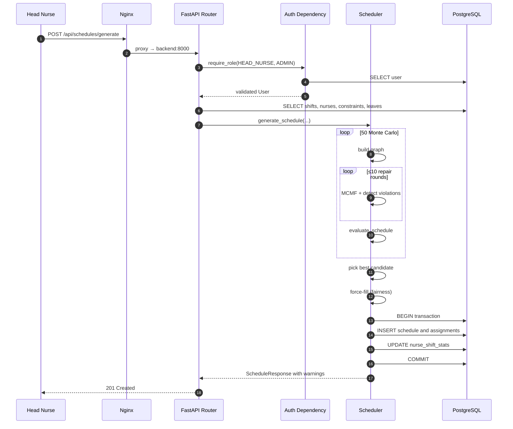

# Project Book — Smart Nurse Scheduling System (SNSS)

> **Project Team:** Ido Levy, Nereya Mantzur
> **Academic Year:** 2026
> **Technology Stack:** React 18 · FastAPI · PostgreSQL · Docker · Min-Cost Max-Flow
> **Document:** Academic Project Book — Version 1.0

---

## Table of Contents

1. [Background & Market Survey](#1-background--market-survey)
2. [Objectives & Goals](#2-objectives--goals)
3. [Project Planning & Design](#3-project-planning--design)
4. [System Structure & Architecture, Including Interfaces](#4-system-structure--architecture-including-interfaces)
5. [Implementation & Execution](#5-implementation--execution)
6. [Comparison: Planning vs. Implementation](#6-comparison-planning-vs-implementation)
7. [Future Work & Development](#7-future-work--development)
8. [Bibliography & References](#8-bibliography--references)

---

## 1. Background & Market Survey

### 1.1 Problem Domain Definition

The **Nurse Rostering Problem (NRP)** is one of the most canonical and extensively studied problems in operations research and combinatorial optimization. The problem has been formally proven to belong to the **NP-hard** complexity class (Osogami & Imai, 2000), as it combines a large number of mutually conflicting hard constraints (e.g., minimum staffing requirements, mandatory rest periods derived from labor law) and soft constraints (e.g., personal preferences, fatigue distribution, employment-percentage quotas).

In hospital departments — and particularly within the Israeli healthcare system — the construction of a weekly shift roster is, in nearly all cases, still performed manually by the head nurse using spreadsheets (Excel) or pen-and-paper. This process consumes hours of work per week, induces interpersonal friction, suffers from inconsistencies across weeks, and occasionally yields a published roster that violates mandatory rest regulations — a condition that endangers both staff well-being and patient safety.

### 1.2 Justification of System Need

The need for an automated solution arises from four systematic failure modes of the manual process:

1. **Cognitive failure** — the number of possible assignments of *N* nurses to 21 weekly shifts (7 days × 3 shift types) grows exponentially and rapidly exceeds the human working-memory bound.
2. **Regulatory failure** — manual enforcement of multiple inter-day rest rules is error-prone, especially when tens of personal constraints compete for attention.
3. **Fairness failure** — the distribution of "heavy" shifts (nights, weekends) depends on the scheduler's memory and subjective judgment, with no objective mechanism guaranteeing equitable load distribution over time.
4. **Post-publication tracking failure** — changes after publication (swaps, late leaves) require manual bookkeeping and frequently cause communication breakdowns.

### 1.3 Market Survey — Existing Commercial and Open-Source Alternatives

#### 1.3.1 Commercial Solutions

| System | Vendor | Business Model | Key Strengths | Identified Methodological Limitations |
|---------|--------|----------------|---------------|----------------------------------------|
| **UKG (Kronos) Workforce Dimensions** | UKG Inc. | Enterprise SaaS | Stability, global support, payroll integration. | Rule-based scheduling engine, **not true optimization**; high cost; long implementation projects; lacks native Hebrew support. |
| **NurseGrid** | NurseGrid Inc. | Freemium + Pro | Excellent mobile UX. | Focuses on viewing & swaps only — **does not perform automatic roster generation**. |
| **Snap Schedule 365** | Business Management Systems | Per-seat licensing | Broad industry coverage. | Not healthcare-specific; no built-in model for medical rest-rules. |
| **Shiftboard** | Shiftboard Inc. | SaaS | General workforce-scheduling platform. | Generic optimization; not aware of medical semantics such as the "no morning after night" rule. |
| **QGenda** | QGenda LLC | Healthcare SaaS | Mature optimization engine. | Very high cost; Hebrew/localization gaps; substantial vendor lock-in. |

#### 1.3.2 Open-Source / Academic Solutions

| Project | Technology | Academic Contribution | Operational Limitations |
|---------|-----------|------------------------|--------------------------|
| **OptaPlanner — Nurse Rostering Example** | Java / Drools | Solves NRP via *Local Search* + *Tabu Search*; mature and well documented. | A library only — not an end-to-end system; no UI; no user/role management; requires a complete surrounding application. |
| **NSP-Lib (Curtois & Qu)** | Datasets + C++ benchmark code | The de-facto academic benchmark for NRP solver comparison. | Not a production system; solver engine only. |
| **Schedule.NET, OpenShift Scheduler** | Misc. | Various open-source point solutions. | Sparse maintenance, poor documentation, no compliance with Israeli labor regulations. |

#### 1.3.3 Survey Conclusions & Identified Gaps

The survey reveals a **distinct gap** between two ends of the market spectrum. At one end, commercial products offer expensive, resource-heavy optimization engines but lack algorithmic transparency. At the other end, academic libraries provide mathematically rigorous solvers but lack a usable application shell. **None** of the surveyed solutions integrates the following components holistically under a single roof:

* A **deterministic optimization engine** based on Min-Cost Max-Flow (MCMF) — fast and with formal mathematical guarantees, in contrast to heuristic local search.
* An **iterative repair layer** (Hard-Constraint Repair Loop) that resolves MCMF's structural inability to encode inter-shift constraints as edge costs.
* A lightweight **Monte Carlo** layer for escaping local optima.
* A **Fairness Engine** based on a per-nurse *Fatigue Index*, guaranteeing 100 % coverage while equitably distributing burden.
* A **peer-to-peer Swap Marketplace** that decentralizes post-publication change management.
* Multi-role **RBAC** with clear separation of duties.

The SNSS system was designed to close this gap with a modular, open-source architecture aligned with the constraints of Israeli healthcare regulation.

---

## 2. Objectives & Goals

### 2.1 Functional Requirements (FR)

| ID | Requirement | Description |
|----|-------------|-------------|
| FR-1 | Identity management | Register/login/activate user accounts in three roles: `nurse`, `head_nurse`, `admin`. |
| FR-2 | Constraint submission | A nurse may submit a constraint of level (`CANNOT_WORK` / `PREFER_NOT` / `PREFER`) for a given date and `ShiftType`. |
| FR-3 | Leave requests | Submit, track, approve or reject leave requests over a date range. |
| FR-4 | Weekly slot preparation | Idempotently create 21 weekly slots (7 × 3) via `POST /api/shifts/generate-week`. |
| FR-5 | Automated schedule generation | MCMF-based engine producing a feasible roster honoring all constraint sources. |
| FR-6 | Schedule publication | Explicit `PUT /api/schedules/{id}/publish` flipping `is_published = true`. |
| FR-7 | Swap marketplace | Atomic peer-to-peer offer/claim of assigned shifts. |
| FR-8 | Notifications | In-app notification system, polled every 30 seconds. |
| FR-9 | Monthly hours summary | Personal dashboard with effective-quota completion, charts, prior-month comparison. |
| FR-10 | Fairness dashboard | Manage `fatigue_index` per nurse per month. |

### 2.2 Non-Functional Requirements (NFR)

| ID | Requirement | Success Metric |
|----|-------------|----------------|
| NFR-1 | Scheduler performance | Weekly generation for a department of up to 30 nurses completes in under 5 seconds. |
| NFR-2 | Labor-law enforcement | 100 % of final rosters contain zero violations of the five rest rules. |
| NFR-3 | Shift coverage | 100 % of slots are filled (via Force-Fill layer). |
| NFR-4 | Security | JWT (HS256), bcrypt password hashing, fully parameterized queries. |
| NFR-5 | Availability | Docker health checks; automatic restart on failure. |
| NFR-6 | Maintainability | Clear layer separation; fewer than 15 core server-side modules. |
| NFR-7 | Portability | Single `docker compose up` deployment; no host-OS dependency. |
| NFR-8 | API documentation | Automatic OpenAPI documentation at `/docs` (Swagger UI). |

### 2.3 Milestones

| Phase | Scope | Deliverable |
|-------|-------|-------------|
| M1 | Requirements analysis + market survey | SRS, alternatives comparison document. |
| M2 | Architectural design | C4 diagrams, ERD, API specification. |
| M3 | Infrastructure | PostgreSQL setup, FastAPI skeleton, Docker Compose. |
| M4 | Scheduling core | MCMF + repair loop + Monte Carlo implementation. |
| M5 | Nurse UI & features | Dashboard, ScheduleView, Constraints, Leave, Swap. |
| M6 | Manager UI & features | ManageSchedule, ManageUsers, Fairness Dashboard. |
| M7 | Fairness engine + Force-Fill | `nurse_shift_stats` table, fatigue formula, fallback tiers. |
| M8 | Integration testing, documentation, project book | Complete academic documentation. |

---

## 3. Project Planning & Design

### 3.1 Initial Planning Phase

Planning began with a structured analysis of the NRP, accompanied by an academic literature review (notably Burke et al., 2004 on Nurse Rostering Problems). Three solver families were considered:

1. **Integer Linear Programming (ILP)** — Gurobi/CPLEX-based exact solvers.
2. **Meta-heuristic local search** (Tabu Search, Simulated Annealing) — as exemplified by OptaPlanner.
3. **Min-Cost Max-Flow (MCMF) on a network graph** — polynomial-time but limited in the kinds of constraints directly encodable as edge costs.

### 3.2 Architectural Selection Rationale

A hybrid **MCMF + Repair Loop + Monte Carlo** strategy was selected, justified as follows:

* **Runtime advantage** — MCMF runs in polynomial time ($O(V \cdot E \cdot \log V)$ via Successive Shortest Paths); ILP is exponential in the worst case.
* **Algorithmic transparency** — unlike meta-heuristics, every edge decision is traceable, enabling reproducible debugging.
* **Resolution of MCMF's structural limitation** — inter-shift constraints cannot be expressed as static edge costs, but they can be enforced by post-processing through an iterative repair loop.
* **Probabilistic robustness** — a Monte Carlo layer (50 iterations with varied randomization) provides cheap insurance against local optima of the scoring function.

### 3.3 System Requirements Analysis

| Category | Choice | Rationale |
|----------|--------|-----------|
| Server language | Python 3.12 | Availability of optimization libraries (NetworkX, SciPy); readable syntax; excellent documentation. |
| Server framework | FastAPI | Async support, built-in validation (Pydantic), automatic OpenAPI, dependency injection. |
| Database | PostgreSQL (Neon Cloud) + SQLite (dev) | ACID guarantees, native ENUM types, generous free tier; SQLite for fast local testing. |
| Client language | JavaScript (React 18) | Mature ecosystem, component model, hooks. |
| Communication | REST over JSON | Simplicity, cacheability, future mobile compatibility. |
| Authentication | JWT (HS256) | Stateless, horizontally scalable. |
| Deployment | Docker + Docker Compose | Reproducibility, simple bootstrap. |

### 3.4 Structural Design Considerations

* **Modular Monolith over Microservices** — at the expected scale (single-digit departments, dozens to a few hundred users), the network overhead of microservices is not justified. A single FastAPI app with 11 domain-separated routers was selected.
* **Stateless backend** — every request carries a JWT; no server-side session.
* **Explicit draft/published separation** — a draft roster is invisible to nurses; its purpose is to allow human review prior to publication.
* **Controlled denormalization** — the `fatigue_index` field on `nurse_shift_stats` is stored as a precomputed scalar to enable fast `ORDER BY` operations during force-fill.

### 3.5 C4 Level 1 — System Context Diagram



---

## 4. System Structure & Architecture, Including Interfaces

### 4.1 Overall Architectural Pattern

The system adopts a three-tier **Client–Server** architecture: presentation tier (React SPA), business-logic tier (FastAPI modular monolith), and data tier (PostgreSQL). The middle tier is internally decomposed into sub-layers: *Routers → Auth Dependencies → Service Layer (Scheduler) → ORM*.

### 4.2 C4 Level 2 — Container Diagram



### 4.3 Data Model — ERD Schema



### 4.4 Table Catalog (Schema)

| Table | Key Columns | Purpose |
|-------|------------|---------|
| `users` | `id`, `email` (UQ), `hashed_password`, `role`, `department_id`, `employment_percentage`, `is_active` | Identity + employment profile. |
| `departments` | `id`, `name` (UQ), `min_nurses_morning/afternoon/night` | Tenant unit + default staffing minimums. |
| `schedules` | `id`, `department_id`, `week_start_date`, `is_published` | Weekly roster lifecycle (draft/published). |
| `shift_assignments` | `id`, `schedule_id`, `nurse_id`, `date`, `shift_type` | Concrete roster entries. |
| `shifts` | `id`, `department_id`, `date`, `shift_type`, `required_staff` (UQ on dept+date+type) | Slot definitions. |
| `shift_constraints` | `id`, `nurse_id`, `date`, `shift_type`, `constraint_type` | Nurse preferences. |
| `leave_requests` | `id`, `nurse_id`, `start_date`, `end_date`, `reason`, `status` | Leave workflow. |
| `swap_requests` | `id`, `shift_assignment_id`, `requester_id`, `claimant_id`, `status`, `note`, `created_at` | Marketplace state. |
| `notifications` | `id`, `user_id`, `message`, `is_read`, `created_at` | In-app messaging. |
| `nurse_shift_stats` | `id`, `nurse_id`, `period_year`, `period_month`, `night_shifts_count`, `weekend_shifts_count`, `total_shifts_count`, `forced_assignments_count`, `fatigue_index` | Fairness-engine state. |

### 4.5 Detailed REST API Contracts

All endpoints are mounted under `/api`. Authentication is via `Authorization: Bearer <JWT>`.

#### 4.5.1 Authentication

**POST `/api/auth/login`** — OAuth2 password flow.
```http
POST /api/auth/login
Content-Type: application/x-www-form-urlencoded

username=alice@hospital.org&password=secret
```
Response:
```json
{ "access_token": "eyJhbGciOiJIUzI1NiIsInR5cCI6IkpXVCJ9...", "token_type": "bearer" }
```

**GET `/api/auth/me`**
```json
{
  "id": 17, "email": "alice@hospital.org",
  "first_name": "Alice", "last_name": "Cohen",
  "role": "head_nurse", "department_id": 2,
  "employment_percentage": 100, "is_active": true
}
```

#### 4.5.2 Schedule Generation

**POST `/api/schedules/generate`** (required role: `head_nurse` / `admin`)
```json
{ "department_id": 2, "week_start_date": "2026-06-01" }
```
Response `201 Created`:
```json
{
  "id": 42, "department_id": 2,
  "week_start_date": "2026-06-01", "is_published": false,
  "assignments": [
    { "id": 901, "nurse_id": 17, "date": "2026-06-01", "shift_type": "morning" }
  ],
  "warnings": ["Force-assigned nurse 23 to 2026-06-04 NIGHT"],
  "total_required": 42, "total_assigned": 42
}
```

**PUT `/api/schedules/{id}/publish`** → `200 OK`.

#### 4.5.3 Constraints, Leaves, and Swaps

| Operation | Endpoint | Example Body |
|-----------|----------|--------------|
| Add constraint | `POST /api/constraints/` | `{ "date":"2026-06-03", "shift_type":"night", "constraint_type":"cannot_work" }` |
| Submit leave | `POST /api/leave-requests/` | `{ "start_date":"2026-06-10", "end_date":"2026-06-12", "reason":"Family event" }` |
| Review leave | `PUT /api/leave-requests/{id}/review` | `{ "status":"approved" }` |
| Offer swap | `POST /api/swap-requests` | `{ "shift_assignment_id":901, "note":"..." }` |
| Claim swap | `POST /api/swap-requests/{id}/claim` | — |

#### 4.5.4 Monthly Hours Summary

**GET `/api/shift-summary/me?year=2026&month=6`** — SQL-side aggregation.
```json
{
  "year": 2026, "month": 6,
  "monthly_quota": 160, "effective_quota": 136,
  "leave_days": 3, "leave_hours": 24,
  "total_hours": 80, "hours_remaining": 56,
  "completion_pct": 58.8,
  "shifts_count": 10, "avg_hours_per_shift": 8.0,
  "most_frequent_shift": "morning",
  "shift_breakdown": {
    "morning":   { "count": 6, "hours": 48 },
    "afternoon": { "count": 3, "hours": 24 },
    "night":     { "count": 1, "hours":  8 }
  }
}
```

#### 4.5.5 Error Response Format

```json
{ "detail": "Insufficient permissions" }
```
Pydantic validation errors:
```json
{ "detail": [ { "loc": ["body","date"], "msg": "field required", "type": "value_error.missing" } ] }
```

### 4.6 Client-Side Component Contracts

| Component | Responsibility | Dependencies |
|-----------|---------------|---------------|
| `AuthProvider` | Global user state; login/logout; bootstrap from `sessionStorage`. | `api.js`, React Context. |
| `PrivateRoute` / `ManagerRoute` | Route guards based on user existence and role. | `AuthContext`. |
| `api.js` | Single Axios instance; request interceptor for JWT; response interceptor for 401. | `axios`, `sessionStorage`. |
| `Navbar` | Navigation; 30-second notification polling. | `AuthContext`, `api`. |
| `ScheduleView` | Weekly roster rendering; week navigation; swap action. | `api`. |
| `ManageSchedule` | Three-step orchestration (Prepare → Generate → Publish). | `api`. |

---

## 5. Implementation & Execution

### 5.1 Client Implementation

The client was implemented as a **Single-Page Application** based on Vite + React 18, with Tailwind CSS for styling and Recharts for visualizing the hours-summary dashboard. Global state was kept minimal — only user identity is held in `AuthContext`, persisted in `sessionStorage`. All other view data is fetched on-mount via `useEffect` to prefer data freshness over client-side caching.

The `api.js` module wraps a singleton Axios instance: a request interceptor attaches the JWT to every call, and a response interceptor clears the token and redirects to `/login` on any 401 response — with an explicit exception for the login endpoint itself, where the form is allowed to surface its own local error.

### 5.2 Server Implementation

The server is organized as a FastAPI application with 11 domain-separated routers under `backend/app/routers/`. Each router is thin: it accepts a Pydantic-validated request body, injects `db: Session = Depends(get_db)` and `current_user: User = Depends(get_current_user)`, and delegates business logic to either the ORM directly or to the scheduler service module.

The Auth module (`auth.py`) provides two central primitives: `get_current_user` decodes the JWT (via `python-jose`) and verifies an active user, and `require_role(*roles)` is a dependency factory enabling declarative RBAC enforcement:

```python
def require_role(*roles: RoleEnum):
    def role_checker(current_user: User = Depends(get_current_user)):
        if current_user.role not in roles:
            raise HTTPException(status.HTTP_403_FORBIDDEN, "Insufficient permissions")
        return current_user
    return role_checker
```

### 5.3 Algorithmic Core — `scheduler.py`

The scheduling engine consists of five sequential phases:

#### Phase 1: Flow Graph Construction
* Source vertex `source` → nurse vertex `nurse_i` with capacity $\lceil \text{employmentPercentage} / 100 \times 6 \rceil$ and cost 0.
* `nurse_i → shift_j` with capacity 1 and cost ∈ {0, 1, 2}: `PREFER` → 0, default → 1, `PREFER_NOT` → 2.
* `shift_j → sink` with capacity `required_staff`.
* Edges falling under a static hard block (`CANNOT_WORK` constraint or approved leave) are **omitted entirely** from the graph.

#### Phase 2: Iterative Repair Loop (`_solve_with_constraints`)
Because MCMF solves the entire graph simultaneously, inter-shift constraints (e.g., "no morning after night") cannot be expressed as edge costs. The solution:

```
Solve MCMF → detect violations → add to hard_blocks → re-solve
```

up to 10 repair rounds. Enforced rules (`_detect_constraint_violations`):

1. **24 h rest after Night** — Night on day D ⇒ Morning & Afternoon on D+1 blocked.
2. **8 h rest after Afternoon** — Afternoon on D ⇒ Morning on D+1 blocked.
3. **Max 6 consecutive workdays**.
4. **Max 2 night shifts per 7-day window**.
5. **Max 2 consecutive night shifts**.

#### Phase 3: Monte Carlo Wrapper
50 iterations with shuffled edge order and stochastic dropping of some `PREFER_NOT` edges. Each candidate is scored via `evaluate_schedule`:

| Component | Weight |
|-----------|--------|
| Filled-slot bonus | +100 |
| Unfilled-slot penalty | −200 |
| `PREFER` match bonus | +10 |
| Utilization-variance penalty | −50 × var |
| Hard-constraint violation penalty | −10,000 |

The highest-scoring candidate is selected and persisted.

#### Phase 4: Fairness-Aware Force-Fill (`_force_fill_shifts`)
After MCMF, any still-unfilled slot enters force-fill. The eligible nurse with the **lowest `fatigue_index`** is selected (random tiebreak). Three eligibility tiers:

1. Ideal — not blocked, not assigned today, under weekly cap.
2. Relax weekly cap (still respects "one shift per day" and `CANNOT_WORK`).
3. Override `CANNOT_WORK` as a last resort (approved leaves are **never** overridden).

#### Phase 5: Statistics Update
For every persisted assignment, `NurseShiftStats` is updated via `update_nurse_stats`, and the fatigue formula is recomputed:

$$
\text{fatigueIndex} = 2.0 \cdot n_{\text{night}} + 1.5 \cdot n_{\text{weekend}} + 3.0 \cdot n_{\text{forced}}
$$

### 5.4 End-to-End Data Flow — Schedule Generation



### 5.5 Deployment & Operations

The `docker-compose.yml` orchestrates two services: `backend` (uvicorn:FastAPI on port 8000) and `frontend` (Nginx on port 80, mapped to host port 3000). The `.env` file is loaded via `env_file:` and is **never** baked into the image. The frontend declares `depends_on: backend (service_healthy)`, guaranteeing the API is reachable before the SPA is served.

---

## 6. Comparison: Planning vs. Implementation

### 6.1 Key Architectural Discrepancies

| Item | Initial Plan | Actual Implementation | Analysis of the Change |
|------|--------------|------------------------|--------------------------|
| **Availability layer (`nurse_shift_availability`)** | A dedicated table was planned to store per-nurse-per-shift availability. | Removed in favor of **global availability** (every nurse is available by default) + negative constraints. An idempotent DDL cleanup is performed in `_run_db_cleanup` in `main.py`. | Simplifies the data model and reduces cognitive load on nurses; switches from opt-in to opt-out, aligned with healthcare work culture in which default availability is the norm. |
| **Notification mechanism** | Originally planned as real-time WebSockets. | Replaced with 30-second client-side polling. | The saved maintenance and connection-state management justified the latency increase; the domain tolerates a 30-second lag. |
| **Force-Fill phase** | Not present in the initial plan. | Added at a later stage upon discovery that under high constraint pressure MCMF could leave slots empty. | A substantial pivot that upgraded the coverage guarantee from "maximum flow" to "100 % guaranteed," and introduced a real fairness engine. |
| **`nurse_shift_stats` table** | Not in the initial schema. | Added to support the fairness-aware Force-Fill and the Fairness Dashboard. | A direct consequence of the Force-Fill decision. |
| **RBAC enforcement** | Initially considered distributing role checks across routers. | Consolidated into a single `require_role` FastAPI dependency. | Implementing this cross-cutting concern in one place removes the risk of inconsistency. |
| **Client-state management** | Redux was initially considered. | Replaced by React Context only. | Since ~99 % of state is page-local, Redux would have been over-engineering. |
| **Optimization engine** | Pure ILP (Gurobi) was considered. | MCMF + Repair + Monte Carlo was selected. | Savings on licensing, runtime advantage, and preserved enforcement guarantees through the repair loop. |
| **Fairness Dashboard** | Outlined at a high level only. | Implemented as a dedicated page `/manage/fairness` with per-nurse metrics. | Added when the need to expose `fatigue_index` to managers became apparent. |

### 6.2 Technical Challenges Encountered

1. **Encoding inter-shift constraints** — the fundamental challenge that gave rise to the repair loop. The original idea of encoding such constraints as prohibitively high edge costs failed, because violation depends on the outcome of the assignment itself, introducing non-locality into the flow model.
2. **Local optima** — the Monte Carlo layer (50 iterations) was added after observing that deterministic runs sometimes produced rosters inferior in `PREFER`-matching.
3. **100 % coverage** — recognizing that a system producing a roster with empty slots is unusable in healthcare contexts forced the addition of the fairness-aware Force-Fill layer.
4. **Transactional consistency in swaps** — performing a single transaction that updates `ShiftAssignment.nurse_id` together with `SwapRequest.status='claimed'` eliminates race conditions.
5. **Summary endpoint performance** — moving aggregation from Python to SQL (`GROUP BY`) dramatically reduced `/api/shift-summary/me` response time.
6. **PostgreSQL/SQLite compatibility** — careful use of SQLAlchemy ENUMs that compile to both engines; handling deprecated columns through the idempotent `_run_db_cleanup` routine.

### 6.3 Academic Summary of the Pivots

The most substantial pivot during the project's lifecycle was the shift from a conception of "optimization as a recommendation tool" to "optimization with a guaranteed outcome." Where the initial plan accepted a roster containing gaps (to be filled manually by the head nurse) as a valid product, the implementation actively enforces full coverage via the fairness engine. This change required the addition of a table (`nurse_shift_stats`), a formula (`fatigue_index`), and two code passes (`_force_fill_shifts`, `update_nurse_stats`), but it elevated the system from a prototype to a production-ready application.

---

## 7. Future Work & Development

### 7.1 Functional Extensions

1. **Real-time notifications via WebSockets** — replacing polling with event push will reduce server load and provide an immediate UX.
2. **Mobile application** based on React Native over the same API, supporting push notifications via Firebase Cloud Messaging.
3. **Unified multi-department optimization** — extending the graph with cross-department edges in cases of cross-trained nurses.
4. **Multi-tenancy** — supporting multiple hospitals under a single instance with logical or physical data separation.
5. **Automatic preference learning** — an ML model (e.g., Logistic Regression or Gradient Boosted Trees) that learns from historical constraints and swaps to predict future preferences.
6. **Non-weekly scheduling horizons** — monthly, multi-week, or bi-weekly rosters with dynamic decomposition.

### 7.2 Performance & Scalability Improvements

| Area | Proposed Improvement |
|------|----------------------|
| **Scheduler** | Parallelize the 50 Monte Carlo iterations via `multiprocessing`, or rewrite the core solver as a Rust/C++ binding. |
| **Database** | Add read replicas in Neon to absorb read-heavy traffic (summaries, roster views). |
| **API** | Migrate to FastAPI async endpoints + `asyncpg`. |
| **Client** | Adopt React Query / SWR for managed server state with controlled invalidation. |
| **Build** | Route-level lazy chunking of the SPA bundle. |

### 7.3 Advanced Security

1. **`HttpOnly` cookies with `SameSite=Strict`** in place of `sessionStorage` to eliminate the XSS token-theft vector.
2. **Rate limiting** on `/api/auth/login` via `slowapi` or Nginx.
3. **MFA** via TOTP (Time-based One-Time Password).
4. **Audit log table** for sensitive operations (publish, role change, leave approval).
5. **CSP/HSTS headers** at the Nginx layer.
6. **Automatic secret rotation** via HashiCorp Vault or AWS Secrets Manager.

### 7.4 Observability

* **Prometheus + Grafana** for latency, error-rate, and scheduler-runtime metrics.
* **OpenTelemetry** for distributed tracing across FastAPI ↔ SQLAlchemy ↔ DB.
* **ELK / Loki** for centralized log aggregation.
* **Alerting** on 5xx spikes or scheduler failures.

### 7.5 Long-Term Maintenance

* **CI/CD** using GitHub Actions, with gates for unit tests (pytest), integration tests, and linting (ruff, ESLint).
* **Schema migrations** managed via Alembic instead of `create_all`.
* **Architecture-as-code** documentation using C4 + Mermaid under `/docs`.
* **Property-based testing** of `evaluate_schedule` and constraint enforcement using Hypothesis.

---

## 8. Bibliography & References

### 8.1 Academic Literature — NRP and Optimization

1. Burke, E. K., De Causmaecker, P., Vanden Berghe, G., & Van Landeghem, H. (2004). *The state of the art of nurse rostering*. **Journal of Scheduling**, 7(6), 441–499. https://doi.org/10.1023/B:JOSH.0000046076.75950.0b
2. Osogami, T., & Imai, H. (2000). *Classification of various neighborhood operations for the nurse scheduling problem*. **Algorithms and Computation — ISAAC 2000**, LNCS 1969, 72–83.
3. Cheang, B., Li, H., Lim, A., & Rodrigues, B. (2003). *Nurse rostering problems — A bibliographic survey*. **European Journal of Operational Research**, 151(3), 447–460.
4. Ahuja, R. K., Magnanti, T. L., & Orlin, J. B. (1993). *Network Flows: Theory, Algorithms, and Applications*. Prentice Hall.
5. Goldberg, A. V., & Tarjan, R. E. (1989). *Finding minimum-cost circulations by canceling negative cycles*. **Journal of the ACM**, 36(4), 873–886.
6. Curtois, T., & Qu, R. (2014). *Computational results on new staff scheduling benchmark instances*. Technical Report, University of Nottingham.
7. Metropolis, N., & Ulam, S. (1949). *The Monte Carlo Method*. **Journal of the American Statistical Association**, 44(247), 335–341.

### 8.2 Official Technical Documentation

8. FastAPI Documentation (2024). *FastAPI — Modern, fast (high-performance) web framework for building APIs with Python*. https://fastapi.tiangolo.com/
9. SQLAlchemy Documentation (2024). *SQLAlchemy 2.0 ORM Tutorial*. https://docs.sqlalchemy.org/en/20/
10. Pydantic Documentation (2024). *Pydantic V2 — Data validation using Python type hints*. https://docs.pydantic.dev/
11. PostgreSQL Global Development Group (2024). *PostgreSQL 16 Documentation*. https://www.postgresql.org/docs/16/
12. NetworkX Developers (2024). *NetworkX — Network Analysis in Python — `min_cost_flow`*. https://networkx.org/documentation/stable/reference/algorithms/flow.html
13. Meta Open Source (2024). *React 18 — Documentation*. https://react.dev/
14. Vite Team (2024). *Vite — Next Generation Frontend Tooling*. https://vitejs.dev/
15. Tailwind Labs (2024). *Tailwind CSS Documentation*. https://tailwindcss.com/docs
16. Docker Inc. (2024). *Docker Compose Specification*. https://docs.docker.com/compose/compose-file/
17. NGINX Inc. (2024). *NGINX Reverse Proxy Documentation*. https://docs.nginx.com/

### 8.3 Standards & Security

18. Jones, M., Bradley, J., & Sakimura, N. (2015). *RFC 7519 — JSON Web Token (JWT)*. Internet Engineering Task Force. https://www.rfc-editor.org/rfc/rfc7519
19. Hardt, D. (2012). *RFC 6749 — The OAuth 2.0 Authorization Framework*. IETF.
20. Provos, N., & Mazières, D. (1999). *A Future-Adaptable Password Scheme (bcrypt)*. **USENIX Annual Technical Conference**.
21. OWASP Foundation (2023). *OWASP Top Ten Web Application Security Risks*. https://owasp.org/www-project-top-ten/
22. Fielding, R. T. (2000). *Architectural Styles and the Design of Network-based Software Architectures* (Doctoral dissertation, University of California, Irvine).

### 8.4 Software Architecture & Design Patterns

23. Fowler, M. (2002). *Patterns of Enterprise Application Architecture*. Addison-Wesley.
24. Evans, E. (2003). *Domain-Driven Design: Tackling Complexity in the Heart of Software*. Addison-Wesley.
25. Brown, S. (2018). *The C4 model for visualising software architecture*. https://c4model.com/
26. Newman, S. (2021). *Building Microservices* (2nd ed.). O'Reilly Media.
27. Richardson, C. (2018). *Microservices Patterns*. Manning Publications.

### 8.5 Medical Domain & Regulation

28. International Labour Organization (2019). *ILO Nursing Personnel Convention, 1977 (No. 149)*. https://www.ilo.org/
29. Ministry of Health, State of Israel (2020). *Working-Hours and Rest Regulations for Nursing Personnel*. Jerusalem.
30. American Nurses Association (2014). *Addressing Nurse Fatigue to Promote Safety and Health*.

---

*Academic Project Book — Smart Nurse Scheduling System, 2026.*
