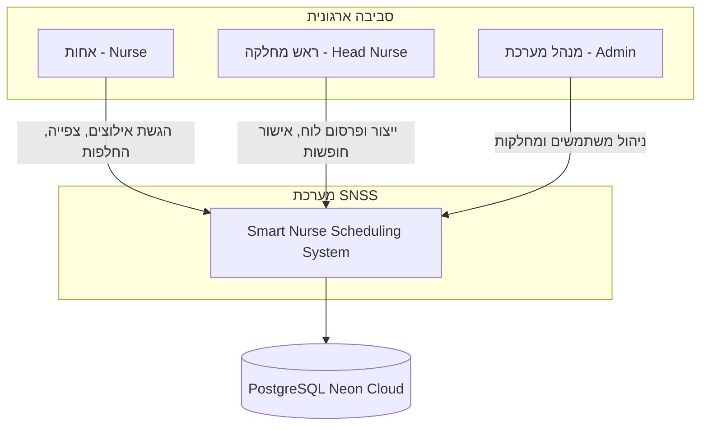
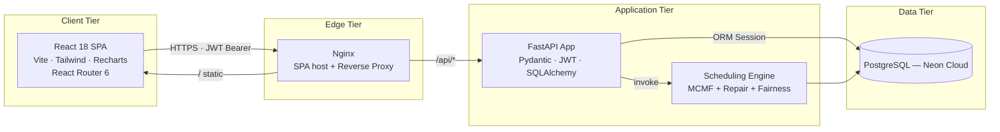
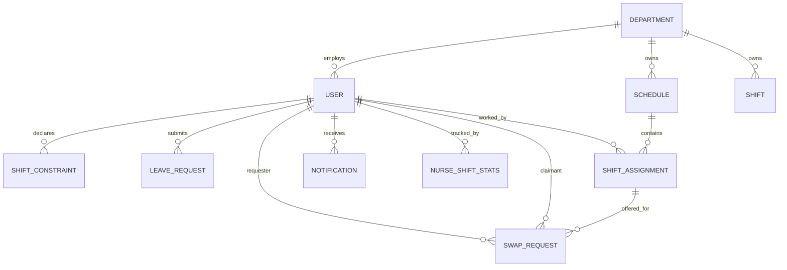
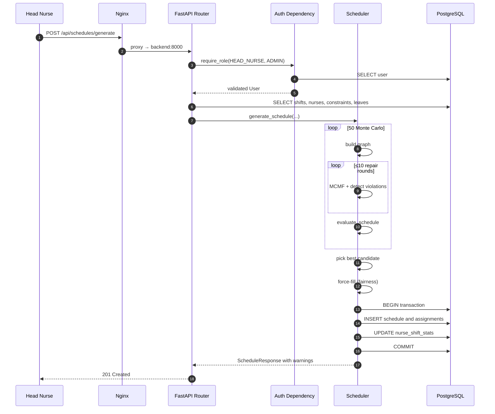

<div dir="rtl">

# ספר פרויקט — מערכת חכמה לשיבוץ משמרות אחיות
### *Smart Nurse Scheduling System (SNSS)*

> **צוות הפרויקט:** עידו לוי, נראיה מנצור
> **שנת אקדמית:** 2026
> **מחסנית טכנולוגית:** React 18 · FastAPI · PostgreSQL · Docker · אלגוריתם זרימה במחיר מינימלי (Min-Cost Max-Flow)
> **מסמך:** ספר פרויקט אקדמי — גרסה 1.0

---

## תוכן עניינים

1. [רקע כולל סקר שוק](#1-רקע-כולל-סקר-שוק)
2. [יעדים](#2-יעדים)
3. [תכנון](#3-תכנון)
4. [מבנה המערכת וארכיטקטורה כולל ממשקים](#4-מבנה-המערכת-וארכיטקטורה-כולל-ממשקים)
5. [ביצוע](#5-ביצוע)
6. [השוואת תכנון מול ביצוע](#6-השוואת-תכנון-מול-ביצוע)
7. [פיתוח עתידי](#7-פיתוח-עתידי)
8. [ביבליוגרפיה](#8-ביבליוגרפיה)

---

## 1. רקע כולל סקר שוק

### 1.1 הגדרת תחום הבעיה

בעיית שיבוץ כוח אדם רפואי (*Nurse Rostering Problem* — להלן NRP) מהווה אחת מהבעיות הקנוניות והנחקרות ביותר בתחום חקר הביצועים והאופטימיזציה הקומבינטורית. הבעיה הוכחה כשייכת למחלקת הסיבוכיות **NP-hard** (Osogami & Imai, 2000), ומשלבת מספר רב של אילוצים קשים (*hard constraints*) ורכים (*soft constraints*) הניצבים בקונפליקט אינהרנטי זה עם זה: דרישות איוש מינימליות לכל משמרת, חוקי מנוחה הנגזרים מחקיקת עבודה (24 שעות מנוחה לאחר משמרת לילה, מגבלת ימי עבודה רצופים), העדפות אישיות של עובדים, בקשות חופשה מאושרות, אחוזי משרה משתנים ומדדי הוגנות בחלוקת עומס.

במחלקות בית-חולים בישראל, בניית לוח שיבוץ שבועי נעשית כיום כמעט תמיד באופן ידני על-ידי אחות ראשית, באמצעות גיליונות אלקטרוניים (Excel) או נייר ועיפרון. תהליך זה נמשך שעות ארוכות, יוצר חיכוך אינטרפרסונלי, סובל מאי-עקביות בין שבועות, ולעיתים מסתיים בלוח שיבוץ המפר את חוקי המנוחה המנדטוריים — מצב המסכן הן את העובד והן את המטופל.

### 1.2 הצדקת הצורך במערכת

הצורך במערכת אוטומטית נובע מארבעה כשלים שיטתיים של התהליך הידני:

1. **כשל קוגניטיבי** — מספר הצירופים האפשריים של שיבוץ N אחיות ל-21 משמרות שבועיות (7 ימים × 3 משמרות) גדל אקספוננציאלית, ועובר במהירות את גבולות זיכרון העבודה האנושי.
2. **כשל רגולטורי** — אכיפה ידנית של חוקי המנוחה הינה מועדת לטעויות, במיוחד כאשר עשרות אילוצים אישיים מתחרים על תשומת הלב.
3. **כשל הוגנות** — חלוקת משמרות "כבדות" (לילות, סופי-שבוע) תלויה בזיכרון של המשבץ ובשיקולים סובייקטיביים, ללא מנגנון אובייקטיבי המבטיח חלוקה מאוזנת לאורך זמן.
4. **כשל מעקב פוסט-פרסום** — שינויים שמתבצעים לאחר פרסום הלוח (החלפות בין אחיות, ביטולים, חופשות פתע) דורשים תחזוקה ידנית ויוצרים כשלי תקשורת.

### 1.3 סקר שוק — חלופות מסחריות וקוד-פתוח קיימות

#### 1.3.1 פתרונות מסחריים

| מערכת | יצרן | מודל עסקי | יתרונות מרכזיים | מגבלות מתודולוגיות זוהויות |
|--------|------|-----------|------------------|------------------------------|
| **UKG (Kronos) Workforce Dimensions** | UKG Inc. | מנוי ארגוני (Enterprise SaaS) | יציבות, תמיכה גלובלית, אינטגרציה לשכר. | מנוע שיבוץ מבוסס כללים (rule-based), ללא אופטימיזציה אמיתית; יקר; דורש פרויקט הטמעה ארוך; אינו תומך בעברית out-of-the-box. |
| **NurseGrid** (Nurse Scheduling) | NurseGrid Inc. | Freemium + Pro | חוויית משתמש מובייל מצוינת. | התמקדות בצפייה ובהחלפות בלבד — אינו מבצע *generation* אוטומטי של לוח. |
| **Snap Schedule 365** | Business Management Systems | רישוי לפי מושב | כיסוי תעשיות רחב. | אינו ייעודי לתחום הבריאות; ללא מודל אילוצי-עבודה מובנה לחוקי מנוחה רפואיים. |
| **Shiftboard** | Shiftboard Inc. | SaaS | פלטפורמה לשיבוץ כוח עבודה כללי. | אופטימיזציה גנרית; אינה מודעת לסמנטיקה רפואית (לילה→מנוחת 24ש). |
| **QGenda** | QGenda LLC | SaaS לתחום הבריאות | מנוע אופטימיזציה בשלות גבוהה. | עלות גבוהה מאוד; פערי עברית ולוקליזציה; *vendor lock-in* משמעותי. |

#### 1.3.2 פתרונות קוד-פתוח אקדמיים

| פרויקט | טכנולוגיה | תרומה אקדמית | מגבלות תפעוליות |
|---------|-----------|--------------|------------------|
| **OptaPlanner — Nurse Rostering Example** | Java / Drools | פתרון בעיית NRP באמצעות *Local Search* + *Tabu Search*. ספרייה בוגרת ומתועדת היטב. | ספרייה בלבד, לא מערכת קצה-לקצה; ללא ממשק UI; ללא ניהול משתמשים/הרשאות; דורש מעטפת אפליקטיבית מלאה. |
| **NSP-Lib (Curtois & Qu)** | Datasets + C++ benchmark code | אבן-בוחן אקדמית סטנדרטית להשוואת אלגוריתמי NRP. | אינה מערכת פרודקשן; מנוע פתרון בלבד. |
| **Schedule.NET, OpenShift Scheduler** | שונות | פתרונות פרטניים בקוד פתוח. | תחזוקה דלילה, חוסר תיעוד, חוסר תאימות לדרישות חוק עבודה ישראליות. |

#### 1.3.3 מסקנות הסקר ופערים שזוהו

ניתוח השוק חושף **פער מובחן** בין שתי קצוות הספקטרום: בקצה אחד נמצאים מוצרים מסחריים יקרים בעלי מנועי אופטימיזציה רעבי-משאבים אך נטולי שקיפות אלגוריתמית; בקצה השני נמצאות ספריות אקדמיות בעלות יסוד מתמטי מוצק אך ללא מעטפת אפליקטיבית שמישה. אף אחד מן הפתרונות שנסקרו אינו משלב באופן הוליסטי את הרכיבים הבאים תחת קורת-גג אחת:

* **מנוע אופטימיזציה דטרמיניסטי** המבוסס על *Min-Cost Max-Flow* (להלן MCMF) — מהיר ובעל ערבויות מתמטיות, להבדיל מ-*Local Search* יוריסטי.
* **שכבת תיקון איטרטיבית** (*Hard-Constraint Repair Loop*) הפותרת את המגבלה המבנית של MCMF בקידוד אילוצים בין-משמרתיים.
* **שכבת *Monte Carlo* קלה** להימלטות ממינימה מקומיים.
* **מנוע הוגנות מבוסס *Fatigue Index*** המבטיח כיסוי 100% תוך חלוקה צודקת של עומס.
* **שוק החלפות פנים-ארגוני** (P2P Swap Marketplace) המבזר את ניהול השינויים פוסט-פרסום.
* **RBAC** רב-תפקידי עם הפרדת חובות ברורה.

מערכת SNSS תוכננה לסגור פער זה באמצעות ארכיטקטורה מודולרית, מבוססת קוד פתוח, ומותאמת לרגולציה הישראלית.

---

## 2. יעדים

### 2.1 דרישות פונקציונליות (Functional Requirements — FR)

| מזהה | דרישה | תיאור |
|------|--------|--------|
| FR-1 | ניהול זהויות | רישום, התחברות והפעלה/השבתה של חשבונות משתמש עם שלושה תפקידים: `nurse`, `head_nurse`, `admin`. |
| FR-2 | הגשת אילוצים | אחות תוכל להגיש אילוץ ברמה (`CANNOT_WORK` / `PREFER_NOT` / `PREFER`) על שילוב מסוים של תאריך ו-`ShiftType`. |
| FR-3 | בקשות חופשה | הגשה, מעקב, אישור או דחייה של בקשות חופשה לטווח תאריכים. |
| FR-4 | הכנת תשתית שבוע | הקמת 21 *slots* שבועיים (7 ימים × 3 משמרות) באמצעות פעולה אידמפוטנטית `POST /api/shifts/generate-week`. |
| FR-5 | ייצור לוח שיבוץ אוטומטי | מנוע מבוסס MCMF המייצר לוח חוקי תוך התחשבות בכל מקורות האילוץ. |
| FR-6 | פרסום לוח | פעולה מפורשת `PUT /api/schedules/{id}/publish` המשנה `is_published=true`. |
| FR-7 | שוק החלפות | יכולת אחות להציע משמרת ולמשוך משמרת פנויה בפעולה אטומית. |
| FR-8 | התראות | מערכת התראות פנים-אפליקטיבית עם *polling* כל 30 שניות. |
| FR-9 | סיכום שעות חודשי | דשבורד אישי עם השוואה לחודש קודם, גרפים והשלמת מכסה אפקטיבית. |
| FR-10 | דשבורד הוגנות | ניהול מדדי *fatigue_index* פר אחות פר חודש. |

### 2.2 דרישות לא-פונקציונליות (Non-Functional Requirements — NFR)

| מזהה | דרישה | מדד הצלחה |
|------|--------|------------|
| NFR-1 | ביצועי מנוע השיבוץ | ייצור לוח שבועי למחלקה של עד 30 אחיות יסתיים בתוך פחות מ-5 שניות. |
| NFR-2 | אכיפת חוק עבודה | 100% מהלוחות הסופיים יהיו נטולי הפרות של חמשת חוקי המנוחה. |
| NFR-3 | כיסוי משמרות | 100% מה-*slots* יאוישו (באמצעות שכבת Force-Fill). |
| NFR-4 | אבטחה | שימוש ב-JWT (HS256), bcrypt לסיסמאות, *parameterized queries*. |
| NFR-5 | זמינות | תמיכה ב-*health checks* של Docker; אתחול אוטומטי בכשל. |
| NFR-6 | תחזוקתיות | הפרדה ברורה בין שכבות; פחות מ-15 קבצי קוד מרכזיים בצד-שרת. |
| NFR-7 | ניידות | פריסה ב-`docker compose up` יחיד; ללא תלות במערכת ההפעלה המארחת. |
| NFR-8 | תיעוד API | תיעוד OpenAPI אוטומטי ב-`/docs` (Swagger UI). |

### 2.3 אבני דרך (Milestones)

| שלב | תכולה | תוצר עיקרי |
|------|--------|------------|
| M1 | ניתוח דרישות + סקר שוק | מסמך SRS, מסמך השוואת חלופות. |
| M2 | תכנון ארכיטקטוני | דיאגרמות C4, סכמת ERD, מפרט API. |
| M3 | תשתית | הקמת PostgreSQL, FastAPI Skeleton, Docker Compose. |
| M4 | ליבת שיבוץ | מימוש מנוע MCMF + לולאת תיקון + Monte Carlo. |
| M5 | UI ופונקציונליות לאחות | דפי Dashboard, ScheduleView, Constraints, Leave, Swap. |
| M6 | UI ופונקציונליות למנהל | ManageSchedule, ManageUsers, Fairness Dashboard. |
| M7 | מנוע הוגנות + Force-Fill | טבלת `nurse_shift_stats`, נוסחת *fatigue*, fallback tiers. |
| M8 | בדיקות אינטגרציה, תיעוד וכתיבת ספר הפרויקט | תיעוד אקדמי מלא. |

---

## 3. תכנון

### 3.1 שלב התכנון הראשוני

שלב התכנון נפתח בניתוח מובנה של בעיית NRP בליווי סקירת ספרות אקדמית (Burke et al., 2004 על *Nurse Rostering Problems*). נבחנו שלוש משפחות פתרון:

1. **תכנון לינארי בשלמים (ILP)** — מבוסס סולברים כדוגמת Gurobi/CPLEX.
2. **חיפוש מקומי מטא-יוריסטי** (Tabu Search, Simulated Annealing) — בדומה ל-OptaPlanner.
3. **גרף זרימה במחיר מינימלי (MCMF)** — פתרון פולינומיאלי, אך מוגבל בסוג האילוצים הניתנים לקידוד ישיר.

### 3.2 שיקולי בחירה ארכיטקטוניים

הוחלט על אסטרטגיה היברידית **MCMF + Repair Loop + Monte Carlo** מהנימוקים הבאים:

* **יתרון זמן ריצה** — MCMF פולינומיאלי ($O(V \cdot E \cdot \log V)$ במימוש מבוסס *Successive Shortest Paths*); ILP במקרה הגרוע אקספוננציאלי.
* **שקיפות אלגוריתמית** — בניגוד למטא-יוריסטיקה, ניתן לעקוב אחר כל החלטת קצה ולבצע *debugging*.
* **פתרון מגבלת AchOOG** — אילוצים בין-משמרתיים אינם ניתנים לקידוד כעלות-קצה ב-MCMF, אך ניתנים לאכיפה ב-*post-processing* באמצעות לולאת תיקון איטרטיבית.
* **חוסן הסתברותי** — שכבת *Monte Carlo* (50 איטרציות עם *seed* שונה) מהווה הגנה זולה כנגד מינימה מקומיים של פונקציית הציון.

### 3.3 ניתוח דרישות מערכת

| קטגוריה | בחירה | נימוק |
|----------|--------|--------|
| שפת צד-שרת | Python 3.12 | זמינות ספריות אופטימיזציה (NetworkX, SciPy), תחביר קריא, תיעוד מצוין. |
| מסגרת צד-שרת | FastAPI | תמיכה ב-*async*, ולידציה מובנית (Pydantic), OpenAPI אוטומטי, *dependency injection*. |
| מסד נתונים | PostgreSQL (Neon Cloud) + SQLite (dev) | ACID, ENUM נטיב, *generous free tier*; SQLite לבדיקות מקומיות מהירות. |
| שפת צד-לקוח | JavaScript (React 18) | אקוסיסטם בוגר, *component model*, *hooks*. |
| תקשורת | REST/JSON | פשטות, *cacheability*, תאימות עתידית למובייל. |
| אימות | JWT (HS256) | חוסר-מצב, התאמה ל-*horizontal scaling*. |
| פריסה | Docker + Docker Compose | רפרודוקטיביות, פשטות *bootstrap*. |

### 3.4 שיקולי עיצוב מבני

* **Monolith מודולרי על-פני Microservices** — בקנה המידה הצפוי (מחלקות בודדות, עשרות-מאות משתמשים) עלות התקשורת הרשתית בין שירותים אינה מוצדקת. נבחר מבנה של *FastAPI app* יחיד עם 11 *routers* מופרדים תחומית.
* **חוסר-מצב בצד-שרת** — כל בקשה נושאת JWT; ה-*session* אינו נשמר בשרת.
* **הפרדה מפורשת draft/published** — לוח טיוטה אינו נראה לאחיות; מטרתו לאפשר ביקורת אנושית.
* **דה-נורמליזציה מבוקרת** — שדה `fatigue_index` ב-`nurse_shift_stats` מאוחסן בצורה מחושבת מראש לטובת מיון מהיר.

### 3.5 דיאגרמת C4 ברמה 1 (Context)



---

## 4. מבנה המערכת וארכיטקטורה כולל ממשקים

### 4.1 דפוס ארכיטקטוני כולל

המערכת מאמצת ארכיטקטורת **Client–Server** תלת-שכבתית: שכבת מצג (React SPA), שכבת לוגיקה עסקית (FastAPI Monolith Modular), ושכבת נתונים (PostgreSQL). השכבה האמצעית עצמה מפורקת באופן פנימי לתת-שכבות: *Routers → Auth Dependencies → Service Layer (Scheduler) → ORM*.

### 4.2 דיאגרמת C4 ברמה 2 (Containers)



### 4.3 מודל נתונים — סכמת ERD



### 4.4 קטלוג טבלאות (Schema)

| טבלה | עמודות מפתח | ייעוד |
|--------|--------------|--------|
| `users` | `id`, `email` (UQ), `hashed_password`, `role`, `department_id`, `employment_percentage`, `is_active` | זהות + פרופיל העסקה. |
| `departments` | `id`, `name` (UQ), `min_nurses_morning/afternoon/night` | יחידת *tenant* + ברירות מחדל לאיוש. |
| `schedules` | `id`, `department_id`, `week_start_date`, `is_published` | לוח שיבוץ שבועי; מחזור חיים draft/published. |
| `shift_assignments` | `id`, `schedule_id`, `nurse_id`, `date`, `shift_type` | רישומי השיבוץ עצמם. |
| `shifts` | `id`, `department_id`, `date`, `shift_type`, `required_staff` (UQ על שילוב dept+date+type) | מגדירי משבצות. |
| `shift_constraints` | `id`, `nurse_id`, `date`, `shift_type`, `constraint_type` | העדפות אחות. |
| `leave_requests` | `id`, `nurse_id`, `start_date`, `end_date`, `reason`, `status` | תהליך חופשה. |
| `swap_requests` | `id`, `shift_assignment_id`, `requester_id`, `claimant_id`, `status`, `note`, `created_at` | מצב שוק ההחלפות. |
| `notifications` | `id`, `user_id`, `message`, `is_read`, `created_at` | התראות פנים-אפליקטיביות. |
| `nurse_shift_stats` | `id`, `nurse_id`, `period_year`, `period_month`, `night_shifts_count`, `weekend_shifts_count`, `total_shifts_count`, `forced_assignments_count`, `fatigue_index` | מצב מנוע ההוגנות. |

### 4.5 חוזי ממשק REST API מפורטים

כלל ה-*endpoints* פרוסים תחת `/api`. ההזדהות מבוססת על *Header* בצורה `Authorization: Bearer <JWT>`.

#### 4.5.1 אימות

**POST `/api/auth/login`** — זרימת OAuth2 Password Flow.
```http
POST /api/auth/login
Content-Type: application/x-www-form-urlencoded

username=alice@hospital.org&password=secret
```
תגובה:
```json
{ "access_token": "eyJhbGciOiJIUzI1NiIsInR5cCI6IkpXVCJ9...", "token_type": "bearer" }
```

**GET `/api/auth/me`**
```json
{
  "id": 17, "email": "alice@hospital.org",
  "first_name": "Alice", "last_name": "Cohen",
  "role": "head_nurse", "department_id": 2,
  "employment_percentage": 100, "is_active": true
}
```

#### 4.5.2 ייצור לוח

**POST `/api/schedules/generate`** (תפקיד נדרש: `head_nurse` / `admin`)
```json
{ "department_id": 2, "week_start_date": "2026-06-01" }
```
תגובת 201:
```json
{
  "id": 42, "department_id": 2,
  "week_start_date": "2026-06-01", "is_published": false,
  "assignments": [
    { "id": 901, "nurse_id": 17, "date": "2026-06-01", "shift_type": "morning" }
  ],
  "warnings": ["Force-assigned nurse 23 to 2026-06-04 NIGHT"],
  "total_required": 42, "total_assigned": 42
}
```

**PUT `/api/schedules/{id}/publish`** → `200 OK`.

#### 4.5.3 אילוצים, חופשות והחלפות

| פעולה | endpoint | גוף לדוגמה |
|--------|----------|--------------|
| הוספת אילוץ | `POST /api/constraints/` | `{ "date":"2026-06-03", "shift_type":"night", "constraint_type":"cannot_work" }` |
| הגשת חופשה | `POST /api/leave-requests/` | `{ "start_date":"2026-06-10", "end_date":"2026-06-12", "reason":"Family event" }` |
| אישור חופשה | `PUT /api/leave-requests/{id}/review` | `{ "status":"approved" }` |
| הצעת החלפה | `POST /api/swap-requests` | `{ "shift_assignment_id":901, "note":"..." }` |
| משיכת החלפה | `POST /api/swap-requests/{id}/claim` | — |

#### 4.5.4 סיכום שעות

**GET `/api/shift-summary/me?year=2026&month=6`** — אגרגציה ב-SQL בלבד.
```json
{
  "year": 2026, "month": 6,
  "monthly_quota": 160, "effective_quota": 136,
  "leave_days": 3, "leave_hours": 24,
  "total_hours": 80, "hours_remaining": 56,
  "completion_pct": 58.8,
  "shifts_count": 10, "avg_hours_per_shift": 8.0,
  "most_frequent_shift": "morning",
  "shift_breakdown": {
    "morning":   { "count": 6, "hours": 48 },
    "afternoon": { "count": 3, "hours": 24 },
    "night":     { "count": 1, "hours":  8 }
  }
}
```

#### 4.5.5 מבנה תשובות שגיאה

```json
{ "detail": "Insufficient permissions" }
```
שגיאות ולידציה של Pydantic:
```json
{ "detail": [ { "loc": ["body","date"], "msg": "field required", "type": "value_error.missing" } ] }
```

### 4.6 ממשקי צד-לקוח (Component Contracts)

| רכיב | אחריות | תלויות |
|------|---------|---------|
| `AuthProvider` | ניהול מצב משתמש גלובלי, התחברות/יציאה, *bootstrap* מ-`sessionStorage`. | `api.js`, React Context. |
| `PrivateRoute` / `ManagerRoute` | משמרי גישה בהתאם לקיום משתמש ולתפקיד. | `AuthContext`. |
| `api.js` | מופע Axios יחיד, *interceptor* להוספת JWT, *interceptor* טיפול ב-401. | `axios`, `sessionStorage`. |
| `Navbar` | ניווט, *polling* התראות כל 30 שניות. | `AuthContext`, `api`. |
| `ScheduleView` | רינדור לוח שבועי, ניווט בין שבועות, פעולת *Swap*. | `api`. |
| `ManageSchedule` | תזמור 3-שלבי (Prepare → Generate → Publish). | `api`. |

---

## 5. ביצוע

### 5.1 מימוש שכבת הלקוח

הקליינט מומש כ-**SPA** מבוסס Vite + React 18, עם Tailwind CSS לעיצוב ו-Recharts לויזואליזציה של דשבורד שעות. ניהול המצב הגלובלי נשמר מינימליסטי — אך ורק זהות המשתמש מאוחסנת ב-`AuthContext` מאוחסן ב-`sessionStorage`. כל יתר נתוני התצוגה נטענים *on-mount* באמצעות `useEffect` כדי להעדיף טריות-מידע על-פני *caching*.

מנגנון `api.js` עוטף Axios יחיד; *request interceptor* מצרף את ה-JWT לכל קריאה, ו-*response interceptor* מנקה את ה-*token* ומפנה ל-`/login` כל אימת שמתקבל 401 (למעט endpoint ההתחברות עצמו, שם רוצים שגיאת UI מקומית).

### 5.2 מימוש שכבת השרת

הצד-שרת מאורגן ב-FastAPI עם 11 *routers* תחומיים תחת `backend/app/routers/`. כל *router* דק יחסית: מקבל גוף בקשה מתוקף ע"י Pydantic, מזריק `db: Session = Depends(get_db)` ו-`current_user: User = Depends(get_current_user)`, ומאציל לוגיקה ל-ORM או למודול השירות.

מודול ה-Auth (`auth.py`) מספק את שתי הפונקציות המרכזיות: `get_current_user` המפענח את ה-JWT (`python-jose`) ומאמת קיום משתמש פעיל, ו-`require_role(*roles)` שמייצר *factory* של *dependency* ולפיכך מאפשר אכיפת RBAC הצהרתית:

```python
def require_role(*roles: RoleEnum):
    def role_checker(current_user: User = Depends(get_current_user)):
        if current_user.role not in roles:
            raise HTTPException(status.HTTP_403_FORBIDDEN, "Insufficient permissions")
        return current_user
    return role_checker
```

### 5.3 ליבת האלגוריתם — `scheduler.py`

מנוע השיבוץ מורכב מחמישה שלבים סדרתיים:

#### שלב 1: בניית גרף הזרימה
* קדקוד-מקור `source` → קדקוד אחות `nurse_i` בקיבול $\lceil \text{employmentPercentage} / 100 \times 6 \rceil$ ובעלות 0.
* `nurse_i → shift_j` בקיבול 1 ובעלות ∈ {0,1,2}: `PREFER` → 0, ברירת מחדל → 1, `PREFER_NOT` → 2.
* `shift_j → sink` בקיבול `required_staff`.
* קצוות הנופלים תחת אילוץ סטטי קשה (`CANNOT_WORK` או חופשה מאושרת) מושמטים מלכתחילה.

#### שלב 2: לולאת תיקון איטרטיבית (`_solve_with_constraints`)
מאחר ש-MCMF פותר את כל הגרף בו-זמנית, אילוצים בין-משמרתיים (לדוגמה: "אין בוקר אחרי לילה") אינם ניתנים לקידוד כעלות-קצה. הפתרון:

```
פתור MCMF → זהה הפרות → הוסף לקבוצת hard_blocks → פתור מחדש
```

עד 10 סבבי תיקון. הכללים הנאכפים (`_detect_constraint_violations`):

1. **24ש מנוחה אחרי לילה** — לילה ביום D ⇒ בוקר/צהריים ב-D+1 חסומים.
2. **8ש מנוחה אחרי צהריים** — צהריים ב-D ⇒ בוקר ב-D+1 חסום.
3. **מקסימום 6 ימי עבודה רצופים**.
4. **מקסימום 2 לילות בחלון 7 ימים**.
5. **מקסימום 2 לילות רצופים**.

#### שלב 3: עטיפת Monte Carlo
50 איטרציות עם עירבוב סדר קצוות ונפילה סטוכסטית של חלק מקצוות `PREFER_NOT`. כל מועמד מקבל ציון ע"י `evaluate_schedule`:

| רכיב | משקל |
|------|------|
| בונוס למשבצת מאוישת | +100 |
| קנס למשבצת ריקה | −200 |
| בונוס התאמת `PREFER` | +10 |
| קנס שונות ניצולת | −50 × var |
| קנס הפרת אילוץ קשה | −10,000 |

המועמד עם הציון הגבוה ביותר נבחר ונשמר.

#### שלב 4: Force-Fill מודע-הוגנות (`_force_fill_shifts`)
לאחר MCMF, כל משבצת שעדיין אינה מאוישת תעבור מילוי כפוי. האחות הזכאית בעלת ה-`fatigue_index` הנמוך ביותר נבחרת (שבירת תיקו אקראית). שלושה דרגים של זכאות:

1. אידיאלי: לא חסום, לא משובץ באותו יום, מתחת לתקרה השבועית.
2. הרפיית התקרה השבועית.
3. עקיפת `CANNOT_WORK` (מוצא אחרון; חופשות מאושרות **אינן** נעקפות לעולם).

#### שלב 5: עדכון סטטיסטיקות
לכל שיבוץ נשמר, מתעדכנת `NurseShiftStats` באמצעות `update_nurse_stats`, ונוסחת ה-*fatigue* מחושבת מחדש:

$$
\text{fatigueIndex} = 2.0 \cdot n_{\text{night}} + 1.5 \cdot n_{\text{weekend}} + 3.0 \cdot n_{\text{forced}}
$$

### 5.4 זרימת הנתונים בייצור לוח (סיקוונס מלא)



### 5.5 פריסה ותפעול

`docker-compose.yml` מתזמר שני שירותים: `backend` (uvicorn:FastAPI על פורט 8000) ו-`frontend` (Nginx על פורט 80, מופה לפורט 3000). ה-`.env` נטען דרך `env_file:` ואינו נצרב בתמונת ה-Docker. ה-frontend מצהיר `depends_on: backend (service_healthy)`, מה שמבטיח שה-API פעיל לפני שה-SPA נחשף.

---

## 6. השוואת תכנון מול ביצוע

### 6.1 פערים ארכיטקטוניים מרכזיים

| פריט | תכנון ראשוני | ביצוע בפועל | ניתוח השינוי |
|------|----------------|----------------|----------------|
| **שכבת זמינות (`nurse_shift_availability`)** | תוכננה טבלה ייעודית לאחסון זמינות פר אחות-משמרת. | הוסרה לטובת *availability גלובלית* (כל אחות זמינה כברירת מחדל) + אילוצים שליליים. בוצע ניקוי DDL אידמפוטנטי ב-`_run_db_cleanup` ב-`main.py`. | פישוט מודל הנתונים, צמצום *cognitive load* על האחות; מעבר מ-*opt-in* ל-*opt-out* תואם לתרבות עבודה רפואית בה ברירת המחדל היא זמינות. |
| **מנגנון התראות** | תוכננו WebSockets לזמן-אמת. | הוחלף ב-*polling* כל 30 שניות. | החיסכון בתחזוקה ובניהול מצב הקשרים הצדיק את עיכוב זמן-המחזור; הדומיין סובלני ל-30ש. |
| **שלב Force-Fill** | לא תוכנן בשלב הראשוני. | נוסף בשלב מתקדם כאשר התגלה שבסיטואציות עומס גבוה, MCMF עלול להותיר משבצות ריקות. | פיבוט מהותי שהפך את ערבות הכיסוי מ"מקסימום זרימה" ל-"100% מובטח", תוך הוספת מנוע הוגנות אמיתי. |
| **טבלת `nurse_shift_stats`** | לא הוגדרה בתכנון הראשוני. | נוספה כדי לתמוך ב-Force-Fill ההוגן ובדשבורד ההוגנות. | תוצר ישיר של החלטת ה-Force-Fill. |
| **ניהול הרשאות** | נשקל פיזור בדיקות התפקיד בכל *router*. | מוקם פתרון יחיד ב-`require_role` בתור FastAPI *Dependency*. | מימוש *cross-cutting concern* בנקודה אחת מקטין סיכון לאי-עקביות. |
| **ניהול מצב צד-לקוח** | נשקלה ספריית Redux. | הוחלף ב-React Context בלבד. | בהינתן ש-99% מהמצב הוא *page-local*, Redux היה *over-engineering*. |
| **מנוע אופטימיזציה** | נשקל ILP טהור (Gurobi). | נבחר MCMF + Repair + Monte Carlo. | חיסכון בעלות רישוי, יתרון זמן ריצה, ושימור ערבויות אכיפה דרך הלולאה. |
| **דשבורד הוגנות** | תוכנן בקווי-מתאר בלבד. | מומש כדף ייעודי `/manage/fairness` עם מטריקות פר אחות. | התווסף בעקבות הצורך לחשוף את `fatigue_index` למנהלים. |

### 6.2 אתגרים טכניים שהתעוררו וההתמודדות

1. **קידוד אילוצים בין-משמרתיים** — האתגר היסודי שהוליד את לולאת התיקון. הפתרון המקורי (לקדד אילוצים אלו כעלויות גבוהות) נכשל כי הופעת ההפרה תלויה בתוצאת השיבוץ עצמה, יצירת אי-מקומיות במודל הזרימה.
2. **מינימה מקומיים** — שכבת *Monte Carlo* (50 איטרציות) נוספה לאחר שהובחן כי הרצה דטרמיניסטית מייצרת לעיתים פתרון נחות מבחינת `PREFER`.
3. **כיסוי 100%** — ההכרה שמערכת המייצרת לוח עם משמרות ריקות אינה שמישה ברפואה, חייבה את הוספת שכבת ה-Force-Fill ההוגן.
4. **עקביות עסקה בהחלפת משמרות** — קריאה חד-עסקית במסד נתונים תוך עדכון `ShiftAssignment.nurse_id` יחד עם `SwapRequest.status='claimed'`, מבטיחה חוסר *race conditions*.
5. **ביצועי סיכום שעות** — מעבר מאגרגציה בפייתון ל-`GROUP BY` ב-SQL הוריד דרמטית את זמן התגובה של `/api/shift-summary/me`.
6. **תאימות PostgreSQL/SQLite** — שימוש בענייני ENUM של SQLAlchemy שיוכלו לקופל לשתי המנועים; טיפול בעקבות `DROP COLUMN IF EXISTS` באמצעות `_run_db_cleanup` אידמפוטנטי.

### 6.3 סיכום אקדמי של הפיבוטים

הפיבוט המהותי ביותר בחיי הפרויקט היה המעבר מתפיסה של "אופטימיזציה ככלי המלצה" לתפיסה של "אופטימיזציה עם ערבות תוצאה". בעוד שהתכנון הראשוני קיבל כפרודוקט תקין לוח שמכיל פערים שיוצגו לראש המחלקה לתיקון ידני, הביצוע בפועל אכף כיסוי מלא דרך שילוב של מנוע הוגנות. שינוי זה הצריך הוספת טבלה (`nurse_shift_stats`), נוסחה (`fatigue_index`), ושני מעברי-קוד (`_force_fill_shifts`, `update_nurse_stats`), אך הוא העלה את שמישות המערכת מ-*prototype* ל-*production-ready*.

---

## 7. פיתוח עתידי

### 7.1 הרחבות פונקציונליות

1. **התראות זמן-אמת מבוססות WebSockets** — מעבר מ-*polling* לדחיפת אירועים יוריד עומס שרת ויספק חוויית משתמש מיידית.
2. **אפליקציית מובייל** מבוססת React Native על אותה תשתית API, עם תמיכה ב-*push notifications* דרך Firebase Cloud Messaging.
3. **אופטימיזציה רב-מחלקתית מאוחדת** — הרחבת הגרף לכלול קצוות בין מחלקות במקרים של אחיות מאומנות-צולבת.
4. **רב-דיירות (Multi-Tenancy)** — תמיכה במספר בתי-חולים תחת אינסטנס בודד, עם הפרדה לוגית או פיזית של נתונים.
5. **למידת העדפות אוטומטית** — מודל ML (למשל *Logistic Regression* או *Gradient Boosted Trees*) שלומד מהיסטוריית האילוצים והחלפות לחיזוי העדפות עתידיות.
6. **תמיכה בלוחות לא-שבועיים** — לוחות חודשיים, רב-שבועיים, או דו-שבועיים עם חלוקה דינמית.

### 7.2 שיפורי ביצועים וסקלביליות

| תחום | שיפור מוצע |
|-------|-------------|
| **מנוע השיבוץ** | מקבול 50 איטרציות ה-Monte Carlo דרך `multiprocessing` או הסבת המודול ל-Rust/C++ binding. |
| **שכבת מסד נתונים** | הוספת *read replicas* ל-Neon לשיפור עומסי קריאה (סיכומי שעות, צפייה בלוח). |
| **API** | מעבר ל-FastAPI *async endpoints* + `asyncpg`. |
| **קליינט** | אימוץ React Query / SWR לניהול *server state* עם invalidation מבוקר. |
| **בנייה** | פיצול חבילת ה-SPA ל-*lazy chunks* פר-route. |

### 7.3 הצפנה ואבטחה מתקדמת

1. **Cookies מסוג `HttpOnly + SameSite=Strict`** במקום `sessionStorage` להתמודדות עם וקטור XSS.
2. **Rate-Limiting** ב-`/api/auth/login` באמצעות `slowapi` או Nginx.
3. **MFA** באמצעות TOTP (Time-based One-Time Password).
4. **טבלת *audit log*** לתיעוד פעולות רגישות (פרסום לוח, שינוי תפקיד, אישור חופשה).
5. **CSP/HSTS Headers** ברמת Nginx.
6. **רוטציית סודות אוטומטית** באמצעות Vault או AWS Secrets Manager.

### 7.4 תצפיתיות (Observability)

* **Prometheus + Grafana** לאיסוף מדדי *latency*, *error rate*, *scheduler runtime*.
* **OpenTelemetry** ל-*distributed tracing* לרוחב FastAPI ↔ SQLAlchemy ↔ DB.
* **ELK / Loki** לאיגום לוגים מרכזי.
* **Alerting** לקפיצות בקצב 5xx או כשלי ייצור לוח.

### 7.5 תחזוקה ארוכת-טווח

* **CI/CD** מבוסס GitHub Actions עם *gates* של בדיקות יחידה (pytest), בדיקות אינטגרציה ו-*linting* (ruff, ESLint).
* **Schema migrations** באמצעות Alembic במקום `create_all` אוטומטי.
* **תיעוד אדריכלי כקוד** באמצעות C4 + Mermaid תחת `/docs`.
* **בדיקות *property-based*** ל-`evaluate_schedule` ולאיתור הפרות חוקיות בשיבוצים אקראיים, עם Hypothesis.

---

## 8. ביבליוגרפיה

### 8.1 ספרות אקדמית — בעיית NRP ואופטימיזציה

1. Burke, E. K., De Causmaecker, P., Vanden Berghe, G., & Van Landeghem, H. (2004). *The state of the art of nurse rostering*. **Journal of Scheduling**, 7(6), 441–499. https://doi.org/10.1023/B:JOSH.0000046076.75950.0b
2. Osogami, T., & Imai, H. (2000). *Classification of various neighborhood operations for the nurse scheduling problem*. **Algorithms and Computation — ISAAC 2000**, LNCS 1969, 72–83.
3. Cheang, B., Li, H., Lim, A., & Rodrigues, B. (2003). *Nurse rostering problems — A bibliographic survey*. **European Journal of Operational Research**, 151(3), 447–460.
4. Ahuja, R. K., Magnanti, T. L., & Orlin, J. B. (1993). *Network Flows: Theory, Algorithms, and Applications*. Prentice Hall.
5. Goldberg, A. V., & Tarjan, R. E. (1989). *Finding minimum-cost circulations by canceling negative cycles*. **Journal of the ACM**, 36(4), 873–886.
6. Curtois, T., & Qu, R. (2014). *Computational results on new staff scheduling benchmark instances*. Technical Report, University of Nottingham.
7. Metropolis, N., & Ulam, S. (1949). *The Monte Carlo Method*. **Journal of the American Statistical Association**, 44(247), 335–341.

### 8.2 תיעוד טכני רשמי

8. FastAPI Documentation (2024). *FastAPI — Modern, fast (high-performance) web framework for building APIs with Python*. https://fastapi.tiangolo.com/
9. SQLAlchemy Documentation (2024). *SQLAlchemy 2.0 ORM Tutorial*. https://docs.sqlalchemy.org/en/20/
10. Pydantic Documentation (2024). *Pydantic V2 — Data validation using Python type hints*. https://docs.pydantic.dev/
11. PostgreSQL Global Development Group (2024). *PostgreSQL 16 Documentation*. https://www.postgresql.org/docs/16/
12. NetworkX Developers (2024). *NetworkX — Network Analysis in Python — `min_cost_flow`*. https://networkx.org/documentation/stable/reference/algorithms/flow.html
13. Meta Open Source (2024). *React 18 — Documentation*. https://react.dev/
14. Vite Team (2024). *Vite — Next Generation Frontend Tooling*. https://vitejs.dev/
15. Tailwind Labs (2024). *Tailwind CSS Documentation*. https://tailwindcss.com/docs
16. Docker Inc. (2024). *Docker Compose Specification*. https://docs.docker.com/compose/compose-file/
17. NGINX Inc. (2024). *NGINX Reverse Proxy Documentation*. https://docs.nginx.com/

### 8.3 תקנים ואבטחה

18. Jones, M., Bradley, J., & Sakimura, N. (2015). *RFC 7519 — JSON Web Token (JWT)*. Internet Engineering Task Force. https://www.rfc-editor.org/rfc/rfc7519
19. Hardt, D. (2012). *RFC 6749 — The OAuth 2.0 Authorization Framework*. IETF.
20. Provos, N., & Mazières, D. (1999). *A Future-Adaptable Password Scheme (bcrypt)*. **USENIX Annual Technical Conference**.
21. OWASP Foundation (2023). *OWASP Top Ten Web Application Security Risks*. https://owasp.org/www-project-top-ten/
22. Fielding, R. T. (2000). *Architectural Styles and the Design of Network-based Software Architectures* (Doctoral dissertation, University of California, Irvine).

### 8.4 ארכיטקטורת תוכנה ודפוסי עיצוב

23. Fowler, M. (2002). *Patterns of Enterprise Application Architecture*. Addison-Wesley.
24. Evans, E. (2003). *Domain-Driven Design: Tackling Complexity in the Heart of Software*. Addison-Wesley.
25. Brown, S. (2018). *The C4 model for visualising software architecture*. https://c4model.com/
26. Newman, S. (2021). *Building Microservices* (2nd ed.). O'Reilly Media.
27. Richardson, C. (2018). *Microservices Patterns*. Manning Publications.

### 8.5 דומיין רפואי ורגולציה

28. International Labour Organization (2019). *ILO Nursing Personnel Convention, 1977 (No. 149)*. https://www.ilo.org/
29. משרד הבריאות, מדינת ישראל (2020). *נהלי שעות עבודה ומנוחה לצוות סיעודי*. ירושלים.
30. American Nurses Association (2014). *Addressing Nurse Fatigue to Promote Safety and Health*.

---

*ספר פרויקט אקדמי — Smart Nurse Scheduling System, אוניברסיטה, 2026.*

</div>
