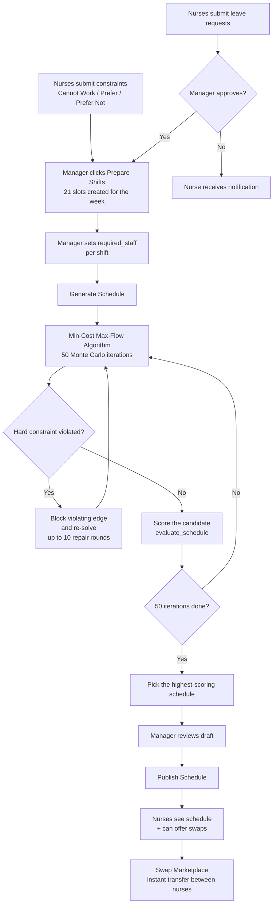
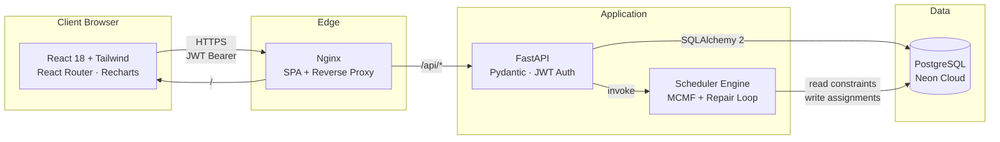

# Project Overview — Smart Nurse Scheduling System

> **Team:** Ido Levy, Nereya Mantzur
> **Stack:** React 18 · FastAPI · PostgreSQL · Docker · Min-Cost Max-Flow

---

## 1. The Problem

Building a weekly shift schedule in hospital departments is a tedious, error-prone manual task. The head nurse must simultaneously balance many conflicting factors:

- **Minimum staffing requirements** for every shift (morning / afternoon / night) on every day of the week.
- **Mandatory labor and rest rules**: 24-hour rest after a night shift, max 6 consecutive workdays, max 2 night shifts per week, etc.
- **Personal preferences** of each nurse (days they cannot work, preferred shifts, personal reasons).
- **Approved leave requests** that must be automatically blocked from assignment.
- **Variable employment percentage** (25% / 50% / 75% / 80% / 100%) defining the maximum number of shifts per nurse.
- **Fairness** — balanced workload distribution across the entire team.

The manual process takes hours, generates friction, and sometimes violates labor laws or leaves shifts uncovered. In addition, post-publish changes (swaps, last-minute leaves) require close tracking and create communication failures.

**Project goal:** Automate the entire pipeline — from constraint submission to schedule publication and inter-nurse swaps — while guaranteeing automatic compliance with labor laws and maximizing staff satisfaction.

---

## 2. Flow Diagram — Schedule Generation Process



---

## 3. The Solution

A full-stack web application that implements an end-to-end workflow:

### For Nurses
- **Personal dashboard** with navigation to every feature.
- **Weekly schedule view** highlighting personal shifts and the current day.
- **Structured constraint form**: pick a date + shift type + constraint level (Cannot / Prefer Not / Prefer).
- **Leave requests** with status tracking (Pending / Approved / Rejected) and automatic notifications.
- **Swap Marketplace** — offer and claim shifts in a single click, with instant transfer and notifications to all parties.
- **Monthly hours summary** with charts: quota completion, weekly distribution, breakdown by shift type.

### For Managers / Head Nurses
- **Generate Schedule** in one click — the algorithm runs 50 iterations and picks the best solution.
- **Manage Users** — manage roles, employment percentages, department assignment, activation/deactivation.
- **Approve leave requests** — automatic blocking in the next generated schedule.
- **Fairness Dashboard** — balanced tracking of workload distribution.
- **Publish schedule** — clear separation between draft and the official schedule visible to nurses.

### Technical Infrastructure
- **JWT Authentication** with role-based access control (`nurse` / `head_nurse` / `admin`).
- **Automatic notifications** with 30-second polling.
- **Docker Compose** for full stack startup with a single command.
- **REST API** documented via Swagger at `/docs`.

---

## 4. The Engineering Challenge

The core of the project is an optimization problem: **how to assign N nurses to 21 weekly shifts while honoring dozens of conflicting constraints, in reasonable time, with high-quality results?**

### The Core Difficulty
A standard **Min-Cost Max-Flow** algorithm solves the entire graph simultaneously — but cannot encode inter-shift constraints (such as "no morning after night") as a simple edge cost, because the dependency only emerges after the assignment is computed.

### Engineering Solution — Hard-Constraint Repair Loop

An **iterative repair loop** wraps the Min-Cost Max-Flow solver:

```
Solve flow network
       ↓
Detect constraint violations in the result
       ↓  violations found?
  YES → add (nurse, date, shift) to hard_blocks → re-solve
  NO  → return feasible candidate
```

On top of that — a **Monte Carlo layer** of 50 iterations, each one:
1. Shuffles edge order and stochastically drops some `PREFER_NOT` edges.
2. Runs the repair loop (up to 10 rounds).
3. Scores the solution via `evaluate_schedule` — a combination of:
   - +100 bonus per filled slot
   - −200 penalty per unfilled slot
   - +10 bonus per preferred match
   - Variance penalty for workload imbalance
   - −10,000 penalty per hard-constraint violation

Finally, the highest-scoring feasible schedule is selected and persisted.

### Additional Challenges Solved
| Challenge | Solution |
|-----------|----------|
| **State sync** between offering and claiming a swap | Atomic DB transaction updating `ShiftAssignment` together with `SwapRequest.status` |
| **Permission consistency** across every endpoint | FastAPI dependencies (`require_role`) enforcing a uniform check |
| **Performance** of the monthly hours summary | SQL-side aggregation (not Python) using `group_by` |
| **Multi-department support** | `department_id` parameter on every relevant query + cross-department blocking |
| **Effective quota** with leaves | `effective_quota = monthly_quota − leave_hours` during summary computation |

---

## 5. Architecture

### Architectural Diagram



### Layer Breakdown

| Layer | Technology | Responsibility |
|-------|------------|----------------|
| **Frontend** | React 18, React Router 6, Tailwind, Recharts, Vite | UI, navigation, forms, charts |
| **API Gateway** | Nginx | SPA serving, reverse proxy to API, static asset caching |
| **Backend** | Python 3.12, FastAPI, Pydantic, SQLAlchemy 2 | Endpoints, validation, auth, ORM |
| **Algorithm Engine** | NetworkX / `scipy.sparse.csgraph` | Min-Cost Max-Flow + repair loop |
| **Auth** | JWT (HS256) via `python-jose`, bcrypt via `passlib` | Authentication and role-based authorization |
| **Database** | PostgreSQL (production) / SQLite (dev) | Relational data store |
| **Deployment** | Docker, Docker Compose | Containerization of all services |

### Folder Structure

```
project/
├── docker-compose.yml         # Service orchestration
├── backend/
│   └── app/
│       ├── main.py            # FastAPI app + CORS + router registration
│       ├── models.py          # 10 ORM models (User, Shift, Schedule...)
│       ├── schemas.py         # Pydantic DTOs
│       ├── auth.py            # JWT + permission dependencies
│       ├── scheduler.py       # ★ Algorithm core
│       └── routers/           # 11 routers (auth, users, schedules...)
└── frontend/
    └── src/
        ├── api.js             # Axios + 401 → logout interceptor
        ├── App.jsx            # PrivateRoute + ManagerRoute
        ├── components/        # Navbar, ShiftHoursSummary
        └── pages/             # 12 pages (Dashboard, ScheduleView...)
```

### Typical Request Flow

```
User clicks "Generate Schedule"
   → React: POST /api/schedules/generate
   → Nginx: proxy to backend:8000
   → FastAPI: Depends(require_role(head_nurse))
   → scheduler.generate_schedule()
       ↳ Read constraints + leave_requests + users from DB
       ↳ Run 50 MCMF + repair iterations
       ↳ INSERT the chosen ShiftAssignments
   → JSON response
   → React: update state + render draft
```

---

## 6. Key Points

### Project Strengths
- ✅ **Full automation** of a process that took hours manually — reduced to minutes.
- ✅ **Automatic enforcement of labor laws** — impossible to produce a schedule that violates rest / consecutive workdays / max nights.
- ✅ **Min-Cost Max-Flow + Repair Loop** — an original combination that overcomes classical MCMF limitations.
- ✅ **Monte Carlo Optimization** — 50 randomized iterations escape local optima.
- ✅ **Decentralized swap marketplace** — reduces manager workload and gives nurses flexibility.
- ✅ **Near-real-time notifications** (30s polling) — full transparency.
- ✅ **Full RBAC** — 3 roles with clear separation of duties.
- ✅ **Containerization** — `docker compose up` and you're running.
- ✅ **Auto-generated API documentation** via Swagger at `/docs`.

### Key Design Decisions
| Decision | Rationale |
|----------|-----------|
| **MCMF + Repair Loop** instead of pure ILP | Significantly faster; ILP is computationally expensive at this scale |
| **Monte Carlo (50 iterations)** | Balances quality vs. runtime; suits a reasonable user load |
| **Stateless JWT** | Enables horizontal scaling of the backend without session affinity |
| **Cloud PostgreSQL (Neon)** | Zero maintenance, automatic backups, generous free tier |
| **Nginx as reverse proxy** | Solves CORS in deployment + caches static assets |
| **Two schedule states (draft / published)** | Allows review before exposure to nurses |
| **Polling instead of WebSockets** | Implementation simplicity; 30s latency acceptable for the domain |

### Possible Future Improvements
- Migrate to WebSockets for real-time notifications.
- Add a Mobile App (React Native) on top of the same backend.
- Multi-department joint optimization (currently each department is computed separately).
- Multi-tenant support (multiple hospitals).
- Use ML to learn nurse preferences from history instead of manual declaration.

---

*Smart Nurse Scheduling System — Final Project, 2026*
